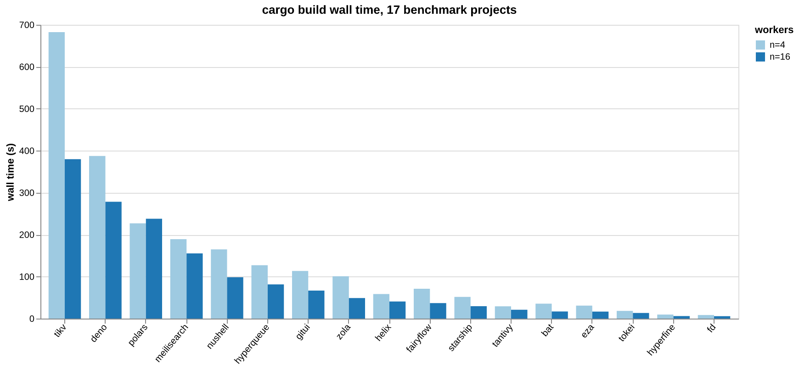
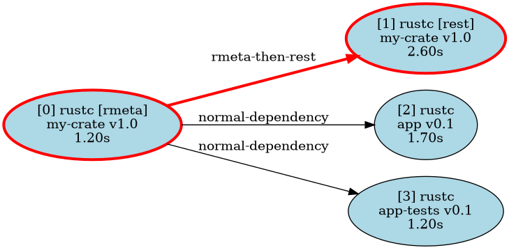
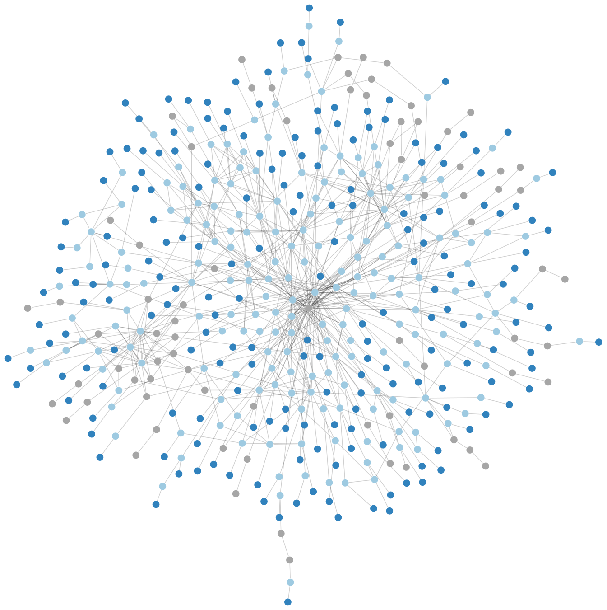
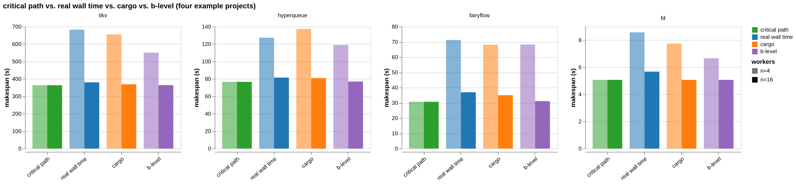
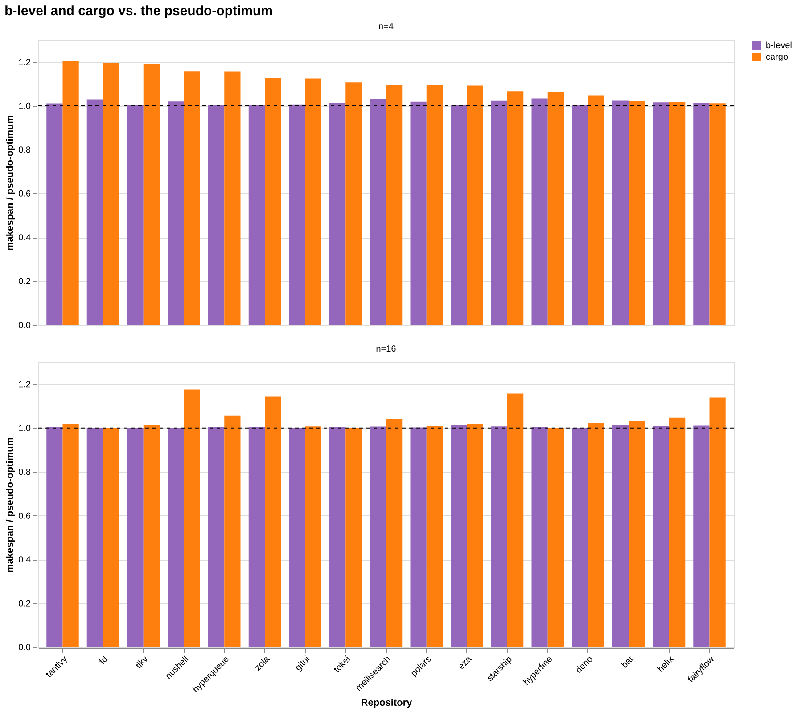
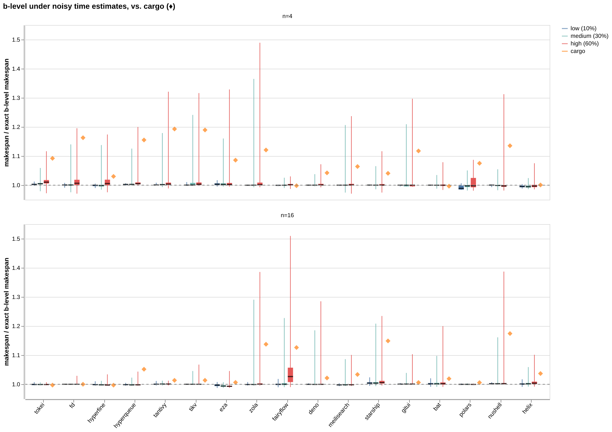
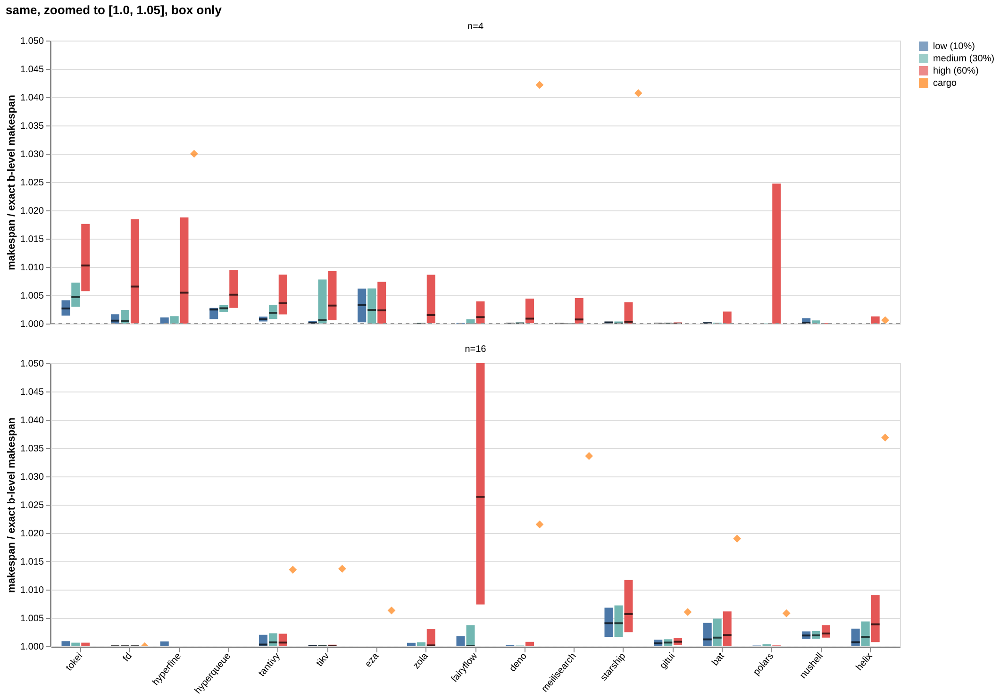
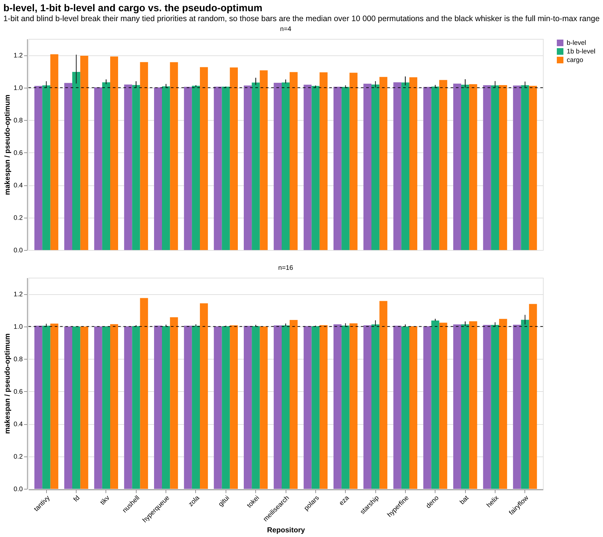
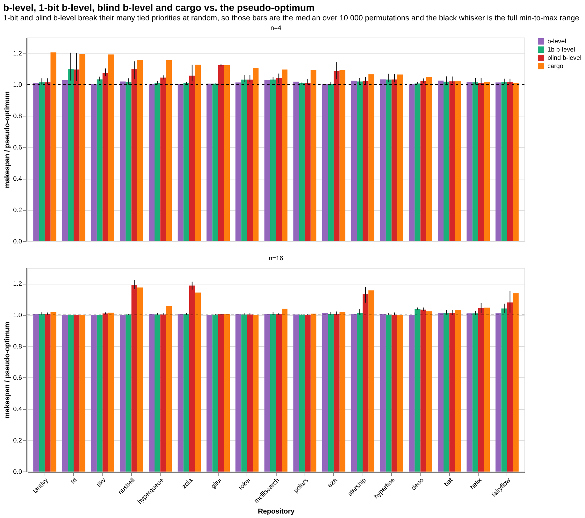

+++
title = "Could Cargo's scheduler be better?"
date = 2026-08-31

[extra]
katex = true
+++

I have been hanging around schedulers for the last ~10 years and I have recently added a new scheduler to [HyperQueue](https://github.com/it4innovations/hyperqueue) (this post is *not* about this scheduler).
It is based on MILP, and the implementation uses [HiGHS](https://docs.rs/highs/latest/highs/), which quickly became a rather large crate in terms of compilation time. I started wondering how Cargo actually schedules its work, and whether it could be done better.

Note 1: I am not familiar with Cargo's internals. The whole analysis here is based on observing its behavior from the outside, not on digging into its source code.

Note 2: For all experiments, rustc 1.97.1 is used, 16 Intel cpu laptop, Linux.

## Benchmark & graphs

First, let's set up a benchmark. I picked 15 well-known Rust projects, plus two projects that I maintain myself: [HyperQueue](https://github.com/it4innovations/hyperqueue) and [FairyFlow](https://github.com/spirali/fairyflow).

Their build times vary quite a lot, so it is not a bad starting point. Note that, for the sake of simplicity, we always consider a plain debug build (`cargo build`); `cargo check` and release builds are not considered here.

To experiment with scheduling, we first need to record the dependency graph between the individual build tasks (i.e. the invocations of `rustc` and friends). We need this graph so we can replay the same build under a different schedule.

Cargo has a build-timing feature (`cargo build --timings`), but its output does not give us enough information to reconstruct the dependency graph. Tracing the syscalls that Cargo and its children make gets us there instead; that is enough to see which files each `rustc` process reads and writes, and in what order, and from that we can derive both the dependencies and precise per-task start/end times.

There is one tricky detail here: to start compiling a crate, we don't need its dependencies to be *fully* compiled; we just need their metadata (`.rmeta`). This is also visible through the traced syscalls (the `.rmeta` file gets created before the rest of the compilation finishes). So in our graph, running `rustc` on a single crate is actually represented as two nodes: **"frontend"**, which produces the metadata, and **"rest"**, which finishes the compilation (codegen and linking). Dependent crates only wait for "frontend" to complete. There is also a **"forced continuation"**: once "frontend" is done, "rest" has to run right after it, on the same worker, because it's the same OS process just continuing to run; the scheduler has no say in it.

Here is a tiny made-up example to illustrate this. Crate `app` and `app-tests` both depend on `my-crate`. They only need to wait for `my-crate`'s frontend, while `my-crate`'s own "rest" node is forced to follow right after its own frontend:

To give a sense of scale, here is the graph for HyperQueue: 471 nodes and 821 edges. 

In the rest of this post I will only use parallelism levels *n=16* and *n=4*. 16 is my laptop's core count, and 4 stands in for a more constrained environment (say, a small CI runner). Note that scheduling is trivial at both extremes: with a single CPU there's nothing to decide, we just have to run everything and the order doesn't matter (ignoring caches, for simplicity); and with an unlimited number of CPUs, we can just run everything that is ready right away. The interesting range is somewhere in between.

## Schedulers

Replay of Cargo's own scheduling decisions (our baseline) is denoted as "cargo" in the following charts. The measured wall time of a real build is usually a bit larger than what we get by replaying its recorded tasks, because of some extra overhead that our simulation doesn't model. But since we compare everything against this same "cargo" replay, and the scheduling logic is the only thing that differs between our schedulers, it is a fair baseline.

My first instinct was to try a **b-level** scheduler. It turned out to be quite promising, and stayed the best simple scheduler I tried, so let me describe it.

For every task, we compute its "b-level" (bottom level): the length of the longest chain of tasks that still needs to run *after* it, following the dependency graph, all the way to the end of the build. In other words:


\text{blevel}(t) = \text{duration}(t) + \max_{t' \in \text{children}(t)} \text{blevel}(t')


(with `blevel(t) = duration(t)` for a task with no children). Whenever a worker becomes free, the scheduler picks the ready task with the highest b-level. The idea is simple: prioritize tasks that are on, or close to, the critical path, since delaying them delays everything that depends on them.

I also tried a bunch of other approaches, just to see if something would beat it: fan-out (prioritize tasks that unblock the most other tasks), shortest/longest-job-first, a couple of b-level variants combined with fan-out ("cp-misf" and a version with a small tie-breaking epsilon), and local search (simulated annealing) starting from a random or from the b-level schedule, using several kinds of moves (random jitter, swapping two tasks, swapping nearby tasks) with random restarts. Generally, all of these ended up being worse than plain b-level, or at best matched it.

## Results

The chart above shows, for a few representative projects, the makespan of the "critical path" (the length of the longest dependency chain; the best possible time achievable with an unlimited number of CPUs), the real measured wall time, the replayed "cargo" schedule, and b-level, at both n=4 and n=16.

You may notice that for HyperQueue at n=4, the real wall time is slightly *smaller* than the replayed "cargo" makespan, even though the replay uses cargo's own recorded order and durations. I looked into this: it happens at n=4 for 3 out of 17 projects (HyperQueue, tantivy, zola), but for none at n=16. To be honest, I do not know why.

Let us make it short: b-level is the winner. Not surprisingly, it helps more when n=4, when resources are more constrained. Across the 17 projects, at n=4 b-level beats cargo's own schedule in 15 out of 17 cases, saving a median of about 8% of the wall time (up to 16% on the best case). At n=16, it still wins in 14 out of 17 cases, though the gain shrinks to a median of about 2% (up to 15%); which makes sense, since there is simply less room for a bad decision to matter when almost everything can run at once anyway.

But how far are we from the actual optimum? Unfortunately, this scheduling problem is NP-hard. Instead, let's build a **"pseudo-optimum"**: the best result we have seen for a given project and CPU count, out of *all* the schedulers we tried, including local search with random restarts run for 10&nbsp;000 iterations for each of the randomized approaches, and the 10&nbsp;000 randomized tie-break runs described in the sections below. It's not guaranteed to be the true optimum, but it is probably a very close to it.

The chart shows b-level and cargo, both divided by the pseudo-optimum, so 1.0 means "as good as the best schedule we found". At n=4, b-level lands at a median of about 1.3% above the pseudo-optimum (worst case 3.3%), while cargo is at a median of about 9.6% above it (worst case just over 20%). At n=16, b-level is a median of 0.4% above (worst case 1.3%), cargo a median of 2.3% above (worst case as high as 17.5%). So a simple greedy heuristic that just picks the highest b-level task turns out to already be very close to what much more expensive search can find.

## Is it really feasible?

The whole approach has one obvious problem: it assumes we know each task's execution time in advance. In reality, we don't have exact numbers; at best we have some rough, historical estimate.

So, how sensitive is b-level to wrong estimates of durations? To test that, I gave the scheduler a noisy "assumed" duration for every task instead of the real one:


\text{assumed}(t) = \text{real}(t) + \mathcal{N}\left(0,\ \sigma \cdot \text{real}(t)\right)


The scheduler makes all of its decisions based on `assumed`, but the simulation still advances time using the task's real, recorded duration; exactly like a real build would behave if our time estimates were off. I tried three noise levels: σ=10% (a reasonably calibrated estimate), σ=30% (fairly rough), and σ=60% (not much better than a guess), each repeated 10&nbsp;000 times per project.

To make this concrete, here are three actual draws from the noise generator, for a short 2s task and a long 20s task:

| real duration | assumed, σ=10% | assumed, σ=30% | assumed, σ=60% |
|---:|---:|---:|---:|
| 2.0 s | 2.19, 2.26, 2.47 s | 2.57, 2.77, 3.40 s | 3.13, 3.55, 4.81 s |
| 20.0 s | 17.21, 22.90, 18.67 s | 11.62, 28.70, 16.02 s | 3.24, 37.39, 12.05 s |

Notice that in the first draw at σ=60%, the 20s task's assumed duration (3.24s) ends up *smaller* than the 2s task's (3.13s); the scheduler would think the long task is the shorter one. That's what "not much better than a guess" looks like in practice.

For better clarity, here is the same data again, zoomed in on the box around 1.0, without the whiskers:

The orange diamond marks the "cargo" baseline; the y-axis itself is already a ratio to plain b-level with exact, noise-free durations. B-level with noisy estimates stays very close to the noise-free b-level makespan across all three noise levels; the median stays within a fraction of a percent, even at σ=60%. Some unlucky individual runs do get noticeably worse (occasionally by 30-50%), but that's the tail, not the typical case; the median of the noisy runs still comfortably beats the "cargo" baseline.

This is good news, because it means we don't actually need to know execution times precisely. We don't even need real time units; a rough, relative estimate is enough, since the quality of the scheduling does not change if we multiply execution times by a constant.

## Is one bit enough?

So how much information do we actually need? The noise experiment says our estimates may be quite wrong; the natural follow-up is how *coarse* they may be. Let us take that to the extreme: the scheduler learns exactly one bit per task: "short" or "long", and nothing else.

Concretely: every task that really takes at most 3 seconds is presented to the scheduler as 1 time unit, and everything longer as 12 time units. The 3 seconds is only where the cut falls; the scheduler never sees that number, only the two labels. B-level is computed from those two numbers alone, while the simulation still advances time using the real recorded durations, exactly as in the noise experiment. Note that the 12 is not an estimate of any duration; it only says how many "short" tasks one "long" task is worth.

btw: only about 1.3% of all the tasks in our benchmark are "long", even though those tasks carry roughly a third of the total compilation work. 

One comment before looking at the results. 
When b-level was computed from real execution times, there was no chance to get a tie. But setting just two constant
generates many same b-levels. In the chart below, the bars for "1b b-level" are medians over 10k runs with randomized tie breaks and the black whiskers show the full range from the best to the worst ordering.

At n=4, this "1b b-level" ends up a median of 1.5% above the pseudo-optimum, against 1.3% for b-level with exact durations and 9.6% for cargo. At n=16 the three numbers are 0.5%, 0.4% and 2.3%. So throwing away everything but one bit still enough to beat the cargo baseline on 16 of the 17 projects at n=4 and on 14 of 17 at n=16.

Let us look where it breaks. fd at n=4 is 9.7% above the pseudo-optimum, the worst bar in the chart, and the reason is that fd has no task longer than 3 seconds at all. The bit is then constant, the scheduler is effectively told that all tasks are equally long, and b-level degenerates into "how deep in the graph is this task". The same thing happens for hyperfine and tokei, where it costs almost nothing.

btw: I only swept a few of combinations of cuts and ratios, so better constants very likely exist; the presented 1b information is one of many options.

## Do we need time information at all?

The obvious next step is to take even that one bit away. If every task is presented to the scheduler as having the same duration, b-level becomes plain graph depth. That needs no timing data, only the shape of the dependency graph, which cargo already knows before it compiles anything.

Ties matter even more here than in the previous section, since every task now carries the same assumed duration: only 393 distinct b-levels remain across all 13&nbsp;144 tasks. So the blind bars get the same treatment, medians over 10&nbsp;000 random tie-breaks with the full range as a whisker.

At n=16 the median project lands 0.7% above the pseudo-optimum, which is close to b-level with exact durations (0.4%), and still ahead of cargo (2.3%). At n=4 the median is 3.2%, against 1.3% for exact b-level and 9.6% for cargo. Even completely blind, it beats the cargo baseline on 16 of 17 projects at n=4 and on 12 of 17 at n=16.

The catch is in the tail; few projects go quite wrong: nushell and zola both at 19% above the pseudo-optimum at n=16, gitui at 12% and nushell at 10% at n=4. These are not unlucky orderings either; gitui's entire range at n=4 is 11.6% to 13.1%, and nushell's best of 10&nbsp;000 orderings at n=16 is still 16% above.

This is also a way to see what the single bit was actually buying. Comparing the green bars with the red ones, the bit barely moves the median (0.7% to 0.5% at n=16), but it collapses the worst case (19% to 4.1%). It is insurance against the tail rather than an average-case improvement. And on fd, hyperfine and tokei the two are literally the same scheduler: no task in those projects is longer than the 3 second cut, so the bit is never set and there is nothing for it to say.

## Conclusion

If we know something about how long tasks take, b-level wins. And "something" can be quite small: the estimates may be badly noisy, or as coarse as a single bit per crate, and most of the benefit survives either way.
And if we are just focused on mean value, then we do not need even this bit.

That makes the whole idea rather practical. A small local database of timings from past builds should already be good enough, and it could be bootstrapped from a shared global database of crate build times, so that even the first build on a fresh machine has something to work with. Judging by the one-bit experiment, such a database would not even have to store durations; a "fast crate" / "slow crate" flag per crate is already useful. And when there is nothing to look up at all, falling back to plain graph depth seems to be a reasonable default.

The other message from this is that there is probably not much left to gain from a cleverer scheduling strategy. Every simple alternative I tried was worse than plain b-level or, at best, matched it, and the expensive searches only found schedules about 1.3% (n=4) and 0.4% (n=16) better than what b-level produces straight away.