+++
title = "Music Theory from Basic Principles (Part 1)"
date = 2025-06-06
[extra]
  katex = true
+++

As a child, I played guitar for a few years. I was also supposed to visit music theory. But the theory teacher was unable to explain why I needed it. So I skipped the theory classes completely. Last year I started to play cello and thought it may be a good idea to give music theory a second chance. Moreover, compared to my childhood, I now have a PhD in computer science, so hopefully I am more ready for understanding theories.

I tried to read some books, papers, and watch videos, but it was quite hard for me. They are usually avoid formal definitions or they use the same term in different contexts without proper explanation. My favorite is the argument by piano, "some property holds because on piano …," like a piano were a universal principle in the universe. I always imagine the LHC producing pianos among other elementary particles.


<p class="center">
<br/>
<i>ChatGPT's visualization of a piano produced by LHC</i>
</p>

Another confusion for me was how things that are culturally dependent, biological facts, physical properties, and mathematical consequences are often explained together without distinguishing their origins.

I am aware that music is about emotions and cannot be fully captured formally. I actually want music to remain mostly an emotional experience for me. But this does not discourage me from trying to explain music theory in a slightly unusual way: build it from basic principles.

In other words, I aim to give a few elementary principles, explain where they come from, and then derive music theory from these principles without introducing new, unexplained things along the way.

*Disclaimer1: I am not a music theory expert. This text summarizes my understanding, and is probably full of mistakes. Think of it as an exploration.*

*Discalimer2: I intentionally avoid standard music theory terminology. Mapping this text to standard terminology is left as an exercise for the reader.*

---

## Definitions

**Sound** is a vibration that travels as a wave through a medium (like air, water, or solids). It starts with something vibrating (e.g., vocal cords, guitar strings, speaker diaphragm). This creates alternating regions of compression and rarefaction, forming pressure waves that travel through the medium. Eventually, these waves reach a receiver (like your eardrum), which converts the vibrations into neural signals that your brain interprets as sound.


## Principles

### Principle 1: We perceive fundamental frequency as pitch

An object doesn't just vibrate at a single frequency. It vibrates at a primary frequency called the *fundamental frequency* (or first harmonic), which determines the pitch we perceive. Simultaneously, it vibrates at higher frequencies called *overtones*, often forming a harmonic series: {{ katex(body="f, 2f, 3f, 4f, \dots") }}

> *\[TODO: Add example on my cello; spectrogram of a single tone on an open string]*

In the following text, we will ignore overtones and represent a tone by a single number (its fundamental frequency).


### Principle 2: Human hearing works on a logarithmic scale

Human perception follows (Weber–Fechner law)[https://en.wikipedia.org/wiki/Weber%E2%80%93Fechner_law]; it says that perception works on a logarithmic scale (or “log scale” for short) and hearing is not an exception, both in case of loudness and the pitch perception. We perceive pitch intervals not as linear differences but as ratios.

What does this mean? On a linear scale, the distance between 1 and 2 is the same as the distance between 10 and 11. On a logarithmic scale, the distance between points is about their ratio. So, the perceived "distance" between 100 Hz and 200 Hz (a 2:1 ratio) is the same as the perceived distance between 1000 Hz and 2000 Hz (also a 2:1 ratio).

Lets have an example of integer numbers between 1-32, on a linear scale it 
would be the evenly distributed points:

<p class="center">
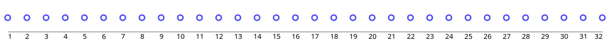
</p>

On a log scale, the same points look like this:

<p class="center">
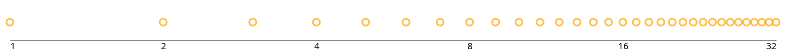
</p>

What is difference? We have much bigger spaces between lower points and they become more condensed for bigger numbers. This provides us a “better” resolution for smaller numbers and lower resolution for the bigger numbers. It is useful to be able to perceive a large range of stimuli.

How quickly does it fade down? Proportionally to the value magnitude. So instead of equally distributed points, we plot points [1, 2, 4, 8, 16, 32] (the numbers are generated by multiplying a previous number by 2). The blue points are on the linear scale, yellow are on the log scale.

<p class="center">
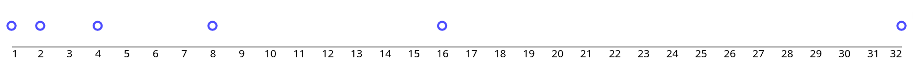<br/>
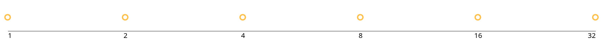<br/>
</p>

We see that when we multiply by 2, they have the same distance on log scale.
And this is a crucial property.

If we move a point by same distance on a linear scale, we are adding the same number (+2, in the following example, all the red arrows have same length):

<p class="center">
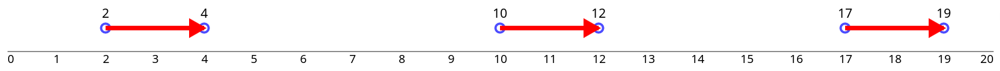
</p>

When we want to move by the same distance on a log scale, we have to multiply by the same number, (*2 in the following example, all the green arrows have the same length).

<p class="center">
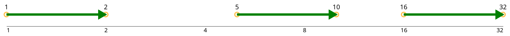
</p>

We will work almost exclusively on a log scale from now on.
Thus, our "basic" operation for moving between pitches will be **multiplication**, not addition.

### Principle 3: Octave Circularity

Two tones are an octave apart if their frequencies have a ratio of {{ katex(body="2:1") }}. We perceive these tones as being, in some sense, "the same" note, just higher or lower. 

If we write our base pitch as {{ katex(body="f") }}, then its octave equivalents are {{ katex(body="\dots, \frac{f}{4}, \frac{f}{2}, f, 2f, 4f, \dots") }}.
Note they lie evenly spaced in log scale. 
Let's assume a pitch 440Hz, we can generate “octave equivalent” tones as follows (the yellow point is 440, green arrows are multiplication by 2, blue arrows are division by 2):

<p class="center">
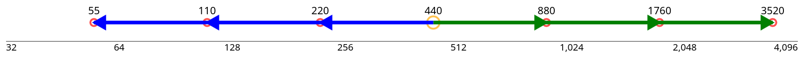
</p>

Out of curiosity, let us look for the last time on linear scale, and see the same picture in that scale:


<p class="center">
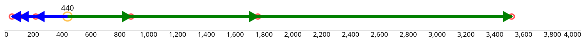
</p>


Octave circularity seems to be something that [we shared with some animals](http://www.neuroscience-of-music.se/eng7.htm).

Mathematically speaking, this principle establishes a *cyclic multiplicative group*.
The cyclic means that it behaves like a wall clock, when the clock arrives to 12, it starts over. Just in our case, our range is not 0-12, but 1-2.
The mutliplicative in the name just means that we are moving by multiplication rather then addition (as in the case of the clock).

### Principle 4: "Small ratios" sound good together

Two tones {{ katex(body="f") }} and {{ katex(body="\frac{a}{b}f") }}, where {{ katex(body="a") }} and {{ katex(body="b") }} are small integers, sound good when played together. Their waveforms align periodically, creating repeating patterns that our brains perceive as pleasant.

For example, {{ katex(body="a = 3") }} , {{ katex(body="b = 2") }}:

{{ katex(body="\frac{3}{2}") }} sounds harmonious with {{ katex(body="1") }}, because the two sine waves align every few cycles. Let's visualize this. The following image shows a signal with frequency 1. To emphasize repetition, starts of a new period of the sine wave is marked by a blue dot.

<p class="center">
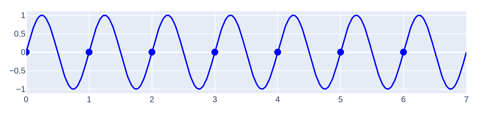
</p>

Now assume a signal with frequency {{ katex(body="\frac{3}{2}f") }}, new periods of sine wave is marked by a star.


<p class="center">
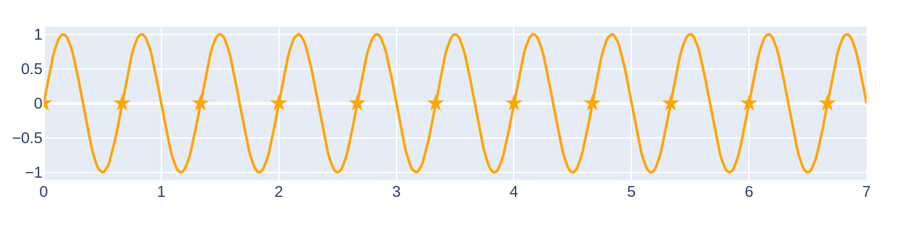
</p>

If we take both images one over another we get:

<p class="center">
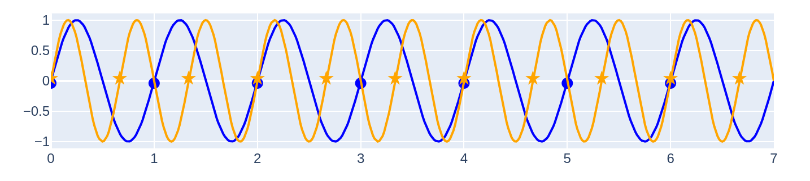
</p>

Here we can see that blue dots and stars overlap in points: 1, 2, 4, 6 …, so both sine waves start a new period simultaneously from these points. So it should not be surprising that if we add these two waves together we get something that repeats from these points. The green line is the sum of the blue and the orange wave. Blue dots and orange stars still have its original meaning. 

<p class="center">
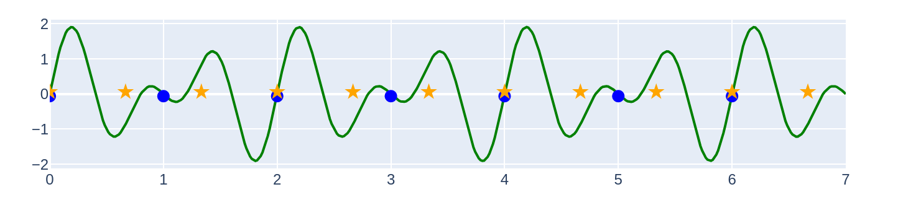
</p>

What is the general rule? If we have a tone with frequencies {{ katex(body="f") }} and {{ katex(body="\frac{a}{b}f") }} where {{ katex(body="\frac{a}{b}") }} is a fraction in the simplified form, then the combined signal would have frequency {{ katex(body="\frac{f}{b}") }}.

So if  {{ katex(body="a") }} and  {{ katex(body="b") }} are small integers, then  {{ katex(body="f") }} and  {{ katex(body="\frac{a}{b}f") }} have close frequencies and their combined signal has also relatively close frequency (i.e., the resulting wave repeats similarly as often as the original ones).


As  {{ katex(body="a") }} and  {{ katex(body="b") }} grow large (e.g. {{ katex(body="\frac{211}{111}") }}, the repetition interval becomes too long and the resulting sound is perceived as dissonant.

Harmonics (multiples of a fundamental frequency) fit this model well. Ratios like {{ katex(body="\frac{2}{1}") }}, {{ katex(body="\frac{3}{1}") }}, {{ katex(body="\frac{4}{1}") }} sound consonant because their waveforms align neatly with the base tone.

For example let us take {{ katex(body="\frac{2}{1}f") }}. The combined signal would looks as follows:

<p class="center">
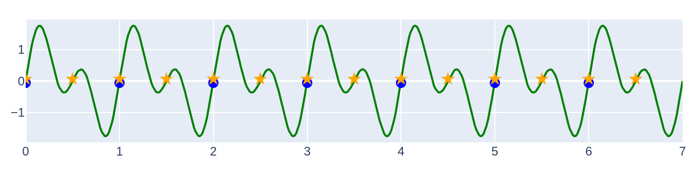
</p>


### Principle 5: Western music adds cultural constraints

For most of this principle, I was not able to find any excact reasons,
it seems that it is mostly based on historic and cultural reason.


#### a) Ratios use only prime factors 2, 3, 5.

 So {{ katex(body="\frac{15}{16}") }} is acceptable because {{ katex(body="\frac{15}{16} = \frac{3\times5}{2\times2\times2\times2}") }}. On the other hand {{ katex(body="\frac{14}{15}") }} is not, because {{ katex(body="14 = 2 \times 7") }}.


#### b) Two triples are musically significant: {{ katex(body="1, \frac{5}{4}, \frac{3}{2}") }} and {{ katex(body="1, \frac{6}{5},\frac{3}{2}") }}.

The first triplet has the nice property that it has ratios 4:5:6.
It is also connected to the first harmonics {{ katex(body="2f, 3f, 4f, 5f") }}: The 2 and 4 is whole octaves, 3 if shifted by octave is {{ katex(body="\frac{3}{2}") }}, 5 shifted twice by octave is {{ katex(body="\frac{5}{4}") }}. So {{ katex(body="\frac{3}{2}") }}, {{ katex(body="\frac{5}{4}") }} are connected to the first two harmonics that are not shifted by the whole octave.

For the second triplet, the ratios are 10:12:15.
{{ katex(body="\frac{3}{2}") }} is the same as in the previous one. And {{ katex(body="\frac{6}{5}") }} can be seen as move by {{ katex(body="\frac{5}{4}") }} in the oposite direction from {{ katex(body="\frac{3}{2}") }}

The blue points are the first triplet, orange points are the second triplet, and the red arrow is multiplication/division by {{ katex(body="\frac{5}{4}") }}.

<p class="center">
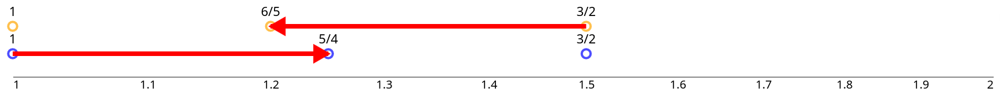
</p>


#### c) Western music favors 7- and 12-tone scales (likely for cultural/historical reasons).


### Principle 6: Human hearing is not perfect

We don’t need exact ratios (like {{ katex(body="\frac{3}{2}") }}) to sound consonant. We only need to get "close enough".

---

## Constructing Scales

We want a finite set of tones to play music. From Principle 4, small ratios are good. But if we include only octaves ({{ katex(body="2^n") }}), all tones will be perceived as the same.

So we start with the next best ratio: {{ katex(body="\frac{3}{2}") }}.

Let $f$ be the base frequency. We define tones relative to $f$. We drop $f$ from notation and represent the tones by ratios:

```
Scale: {1, {{ katex(body="\frac{3}{2}") }}, {{ katex(body="(\frac{3}{2})^2") }} \dots}
```

We map these into the \[1, 2) interval using octave equivalence (divide by 2 as needed). After 12 steps, we find:

{{ katex(body="(\frac{3}{2})^{12} \approx 2^7") }}

So {{ katex(body="t\_{12} \approx 1" )}}, and we stop. We call this set **Scale 0**.

It has nice properties:

* Evenly spaced across \[1, 2)
* Alternating steps of {{ katex(body="\frac{3}{2}") }} and {{ katex(body="\frac{3}{4}") }} (modulo octaves)

But also some problems:

* Ratios are not small (e.g., {{ katex(body="\frac{177147}{131072}") }})
* Extension to other octaves is ambiguous

---

## Better Approaches

### Approach 2: Define goals, then search

We define conditions:

* 7 tones (hard constraint)
* Use only primes 2, 3, 5
* Must include a 4:5:6 triplet
* Denominator $\leq 100$
* Optimize evenness (log scale)

Result: **Scale 1** =

```
{1, {{ katex(body="\frac{9}{8}") }}, {{ katex(body="\frac{5}{4}") }}, {{ katex(body="\frac{4}{3}") }}, {{ katex(body="\frac{3}{2}") }}, {{ katex(body="\frac{5}{3}") }}, {{ katex(body="\frac{15}{8}") }}}
```

Alternate version based on 6:5 gives **Scale 2** =

```
{1, {{ katex(body="\frac{9}{8}") }}, {{ katex(body="\frac{6}{5}") }}, {{ katex(body="\frac{4}{3}") }}, {{ katex(body="\frac{3}{2}") }}, {{ katex(body="\frac{8}{5}") }}, {{ katex(body="\frac{9}{5}") }}}
```

These match well with Western music. Their step sizes cluster around three values:

* {{ katex(body="\frac{16}{15}") }} (short)
* {{ katex(body="\frac{10}{9}") }}, {{ katex(body="\frac{9}{8}") }} (longer)

---

### Approach 3: Equal Steps

What if we use constant multiplicative steps? For 12-tone scale:

```
Step size = {{ katex(body="\sqrt[12]{2}") }}
```

Then:

```
Scale 3: s_X = {{ katex(body="(\sqrt[12]{2})^X") }} for X in 0..11
```

This is **Equal Temperament** (12-TET).

* Steps are symmetric
* Every octave doubles the frequency
* Approximate good ratios well (e.g., {{ katex(body="\frac{3}{2} \approx s\_7") }})
* Enables modulation and reuse of instruments

This is an **elegant compromise** — we give up exact small ratios in exchange for simplicity, symmetry, and transposability.

A plot at the end shows the differences between Scale 0, 1, 2, and 3. The distances to known good ratios are marked visually, showing how each scale aligns (or doesn't).

---

## Conclusion

We’ve derived four scales:

* **Scale 0**: Pure {{ katex(body="\frac{3}{2}") }} construction, but messy ratios
* **Scale 1 & 2**: Just intonation with optimization
* **Scale 3**: Equal temperament

Next, we will explore:

* What do these step differences *mean*?
* Can we model musical tension and resolution?
* How do different scales behave when shifting the base tone?

We’ll also begin mapping these concepts more explicitly to chords, modes, and traditional theory in **Part 2**.

