+++
title = "Music Theory from Basic Principles (Part 1)"
date = 2025-07-20
[extra]
  katex = true
+++

As a child, I played guitar for a few years. I was also supposed to visit music theory. But the theory teacher was unable to explain why I needed it. So I skipped the theory classes completely. Last year I started to play cello and thought it may be a good idea to give music theory a second chance. Moreover, compared to my childhood, I now have a PhD in computer science, so hopefully I am more ready for understanding theories.

I tried to read some books, papers, and watch videos, but it was quite hard for me. They are usually avoid formal definitions or they use the same term in different contexts without proper explanation. My favorite is the argument by piano, "some property holds because on piano …," like a piano were a universal principle in the universe. I always imagine the LHC producing pianos among other elementary particles.

 
<i>ChatGPT's visualization of a piano produced by LHC</i>

Another confusion for me was how things that are culturally dependent, biological facts, physical properties, and mathematical consequences are often explained together without distinguishing their origins.

I am aware that music is about emotions and cannot be fully captured formally. I actually want music to remain mostly an emotional experience for me. But this does not discourage me from trying to explain music theory in a slightly unusual way: build it from basic principles.

In other words, I aim to give a few elementary principles, explain where they come from, and then derive music theory from these principles without introducing new, unexplained things along the way.

*Disclaimer 1: I am not a music theory expert. This text summarizes my understanding, and is probably full of mistakes. Think of it as an exploration.*

*Discalimer 2: I intentionally avoid standard music theory terminology.
I do this to improve my communication with the people educated in music who are not trained in math. In my experience, when you use a standard term (e.g. "Pythagorean tuning"), people automatically bring hidden assumptions into the debate without realizing it. When we are building anonymous "Scale 0", we are forced to just use only the properties in the text without using undefined knowledge.*

---

## Definitions

**Sound** is a vibration that travels as a wave through a medium (like air, water, or solids). It starts with something vibrating (e.g., vocal cords, guitar strings, speaker diaphragm). This creates alternating regions of compression and rarefaction, forming pressure waves that travel through the medium. Eventually, these waves reach a receiver (like your eardrum), which converts the vibrations into neural signals that your brain interprets as sound.

## Principles

### Principle 1: We perceive fundamental frequency as pitch

An object doesn't just vibrate at a single frequency. It vibrates at a primary frequency called the *fundamental frequency* (or first harmonic), which determines the pitch we perceive. Simultaneously, it vibrates at higher frequencies called *overtones*, often forming a harmonic series: {{ katex(body="f, 2f, 3f, 4f, \dots") }}

> *\[TODO: Add example on my cello; spectrogram of a single tone on an open string]*

In the following text, we will ignore overtones and represent a tone by a single number: its fundamental frequency.

### Principle 2: Human hearing works on a logarithmic scale

Human perception often follows the [Weber–Fechner law](https://en.wikipedia.org/wiki/Weber%E2%80%93Fechner_law), which states that perception works on a logarithmic scale (or “log scale” for short). Hearing is no exception, both for loudness and pitch perception. We perceive pitch intervals not as linear differences but as ratios.

What does this mean? On a linear scale, the distance between 1 and 2 is the same as the distance between 10 and 11. On a logarithmic scale, the distance between points is about their ratio. So, the perceived "distance" between 100 Hz and 200 Hz (a 2:1 ratio) is the same as the perceived distance between 1000 Hz and 2000 Hz (also a 2:1 ratio).

Let's take an example of integers between 1 and 32. On a linear scale, they are evenly distributed points:

On a log scale, the same points look like this:

What is the difference? We have much bigger spaces between lower points, and they become more condensed for higher numbers. This provides us with “better” resolution for smaller numbers and lower resolution for bigger numbers. It is useful for perceiving a large range of stimuli.

How quickly does the spacing decrease? Proportionally to the value's magnitude. So instead of equally distributed points, let's plot points [1, 2, 4, 8, 16, 32] (where each number is generated by multiplying the previous number by 2). The blue points are on the linear scale; the yellow are on the log scale.

 
 

We see that when we multiply by 2, the points have the same distance on a log scale. This is a crucial property.

If we move a point by the same distance on a linear scale, we are adding the same number (+2 in the following example; all the red arrows have the same length):

When we move by the same distance on a log scale, we have to multiply by the same number (\*2 in the following example; all the green arrows have the same length).

We will work almost exclusively on a log scale from now on. Thus, our "basic" operation for moving between pitches will be **multiplication**, not addition.

### Principle 3: Octave Circularity

Two tones are an octave apart if their frequencies have a ratio of {{ katex(body="2:1") }}. We perceive these tones as being, in some sense, the "same" note, just higher or lower.

If we write our base pitch as {{ katex(body="f") }}, then its octave equivalents are {{ katex(body="\dots, \frac{f}{4}, \frac{f}{2}, f, 2f, 4f, \dots") }}.

Note that they lie evenly spaced on a log scale.
Let's assume a pitch of 440Hz. We can generate “octave equivalent” tones as follows (the yellow point is 440, green arrows are multiplication by 2, blue arrows are division by 2):

Out of curiosity, let us look one last time at the linear scale and see the same points:

Octave circularity seems to be something that [we share with some animals](http://www.neuroscience-of-music.se/eng7.htm).

Mathematically speaking, this principle establishes a *cyclic multiplicative group*. "Cyclic" means that it behaves like a wall clock: when the hand reaches 12, it starts over. In our case, our range is not 0-12 but 1-2. "Multiplicative" in the name just means that we are moving by multiplication rather than addition (as in the case of the clock).

### Principle 4: "Small ratios" sound good together

Two tones {{ katex(body="f") }} and {{ katex(body="\frac{a}{b}f") }}, where {{ katex(body="a") }} and {{ katex(body="b") }} are small integers, sound good when played together. Their waveforms align periodically, creating repeating patterns that our brains perceive as pleasant.

For example, take {{ katex(body="a = 3") }} and {{ katex(body="b = 2") }}.

A tone of {{ katex(body="\frac{3}{2}f") }} sounds harmonious with a tone of {{ katex(body="f") }} because their sine waves align every few cycles. Let's visualize this. The following image shows a signal with frequency {{ katex(body="f") }}. To emphasize repetition, the start of each period of the sine wave is marked by a blue dot.

Now, consider a signal with frequency {{ katex(body="\frac{3}{2}f") }}. The start of each new period is marked by a star.

If we overlay the two images, we get:

Here we can see that the blue dots and stars overlap at points 2, 4, 6, etc. (assuming the first point is at time 0), so both sine waves start a new period simultaneously at these points. It should not be surprising that if we add these two waves together, we get something that repeats from these points. The green line is the sum of the blue and the orange waves. Blue dots and orange stars still have their original meanings.

\

\
\</p\>

What is the general rule? If we have tones with frequencies {{ katex(body="f") }} and {{ katex(body="\frac{a}{b}f") }}, where {{ katex(body="\frac{a}{b}") }} is a fraction in simplified form, then the combined signal will have a fundamental frequency of {{ katex(body="\frac{f}{b}") }}.

So if {{ katex(body="a") }} and {{ katex(body="b") }} are small integers, then {{ katex(body="f") }} and {{ katex(body="\frac{a}{b}f") }} have frequencies that are close, and their combined signal also has a relatively close frequency (i.e., the resulting wave repeats almost as often as the original ones).

As {{ katex(body="a") }} and {{ katex(body="b") }} grow large (e.g., {{ katex(body="\frac{211}{111}") }}), the repetition interval becomes too long, and the resulting sound is perceived as dissonant.

Harmonics (multiples of a fundamental frequency) fit this model well. Ratios like {{ katex(body="\frac{2}{1}") }}, {{ katex(body="\frac{3}{1}") }}, and {{ katex(body="\frac{4}{1}") }} sound consonant because their waveforms align neatly with the base tone.

For example, let us take {{ katex(body="\frac{2}{1}f") }}. The combined signal looks as follows:

### Principle 5: Western music adds cultural constraints

For most of this principle, I have not been able to find exact reasons; it seems to be based mostly on historical and cultural factors.

#### a) Ratios use only prime factors 2, 3, and 5.

 So {{ katex(body="\frac{15}{16}") }} is acceptable because {{ katex(body="\frac{15}{16} = \frac{3\times5}{2\times2\times2\times2}") }}. On the other hand {{ katex(body="\frac{14}{15}") }} is not, because {{ katex(body="14 = 2 \times 7") }}.

#### b) Two triples are musically significant: {{ katex(body="1, \frac{5}{4}, \frac{3}{2}") }} and {{ katex(body="1, \frac{6}{5},\frac{3}{2}") }}.

The first triplet has the nice property that its frequency ratios are 4:5:6. It is also connected to the first few harmonics {{ katex(body="2f, 3f, 4f, 5f") }}: 2 and 4 are whole octaves, 3 shifted by an octave is {{ katex(body="\frac{3}{2}") }}, and 5 shifted down two octaves is {{ katex(body="\frac{5}{4}") }}. So {{ katex(body="\frac{3}{2}") }} and {{ katex(body="\frac{5}{4}") }} are connected to the first two harmonics that are not simple octaves.

For the second triplet, the ratios are 10:12:15. The {{ katex(body="\frac{3}{2}") }} is the same as in the first one. And {{ katex(body="\frac{6}{5}") }} can be seen as a move by {{ katex(body="\frac{5}{4}") }} in the opposite direction from {{ katex(body="\frac{3}{2}") }}.

The blue points are the first triplet, the orange points are the second triplet, and the red arrow is multiplication/division by {{ katex(body="\frac{5}{4}") }}.

The second triplet also has a unique property. If we want a sequence of ratios 1, X, Y, 2 such that we minimize the largest denominator that occurs in any pairwise ratio, then X=6/5 and Y=3/2 is the optimal solution.

<table style="border-collapse: collapse; margin: 20px auto;">
 <thead>
 <tr style="background-color: #2c5aa0; color: white;">
 <th style="border: 1px solid #ddd; padding: 12px; text-align: center; font-weight: bold;"></th>
 <th style="border: 1px solid #ddd; padding: 12px; text-align: center; font-weight: bold;">{{ katex(body="1") }}</th>
 <th style="border: 1px solid #ddd; padding: 12px; text-align: center; font-weight: bold;">{{ katex(body="\frac{3}{2}") }}</th>
 <th style="border: 1px solid #ddd; padding: 12px; text-align: center; font-weight: bold;">{{ katex(body="\frac{6}{5}") }}</th>
 <th style="border: 1px solid #ddd; padding: 12px; text-align: center; font-weight: bold;">{{ katex(body="2") }}</th>
 </tr>
 </thead>
 <tbody>
 <tr style="background-color: #fff;">
 <td style="border: 1px solid #ddd; padding: 12px; text-align: center; font-weight: bold; background-color: #2c5aa0; color: white;">{{ katex(body="1") }}</td>
 <td style="border: 1px solid #ddd; padding: 12px; text-align: center;">{{ katex(body="1") }}</td>
 <td style="border: 1px solid #ddd; padding: 12px; text-align: center;">{{ katex(body="\frac{2}{3}") }}</td>
 <td style="border: 1px solid #ddd; padding: 12px; text-align: center;">{{ katex(body="\frac{5}{6}") }}</td>
 <td style="border: 1px solid #ddd; padding: 12px; text-align: center;">{{ katex(body="\frac{1}{2}") }}</td>
 </tr>
 <tr style="background-color: #f9f9f9;">
 <td style="border: 1px solid #ddd; padding: 12px; text-align: center; font-weight: bold; background-color: #2c5aa0; color: white;">{{ katex(body="\frac{3}{2}") }}</td>
 <td style="border: 1px solid #ddd; padding: 12px; text-align: center;">{{ katex(body="\frac{3}{2}") }}</td>
 <td style="border: 1px solid #ddd; padding: 12px; text-align: center;">{{ katex(body="1") }}</td>
 <td style="border: 1px solid #ddd; padding: 12px; text-align: center;">{{ katex(body="\frac{5}{4}") }}</td>
 <td style="border: 1px solid #ddd; padding: 12px; text-align: center;">{{ katex(body="\frac{3}{4}") }}</td>
 </tr>
 <tr style="background-color: #fff;">
 <td style="border: 1px solid #ddd; padding: 12px; text-align: center; font-weight: bold; background-color: #2c5aa0; color: white;">{{ katex(body="\frac{6}{5}") }}</td>
 <td style="border: 1px solid #ddd; padding: 12px; text-align: center;">{{ katex(body="\frac{6}{5}") }}</td>
 <td style="border: 1px solid #ddd; padding: 12px; text-align: center;">{{ katex(body="\frac{4}{5}") }}</td>
 <td style="border: 1px solid #ddd; padding: 12px; text-align: center;">{{ katex(body="1") }}</td>
 <td style="border: 1px solid #ddd; padding: 12px; text-align: center;">{{ katex(body="\frac{3}{5}") }}</td>
 </tr>
 <tr style="background-color: #f9f9f9;">
 <td style="border: 1px solid #ddd; padding: 12px; text-align: center; font-weight: bold; background-color: #2c5aa0; color: white;">{{ katex(body="2") }}</td>
 <td style="border: 1px solid #ddd; padding: 12px; text-align: center;">{{ katex(body="2") }}</td>
 <td style="border: 1px solid #ddd; padding: 12px; text-align: center;">{{ katex(body="\frac{4}{3}") }}</td>
 <td style="border: 1px solid #ddd; padding: 12px; text-align: center;">{{ katex(body="\frac{5}{3}") }}</td>
 <td style="border: 1px solid #ddd; padding: 12px; text-align: center;">{{ katex(body="1") }}</td>
 </tr>
 </tbody>
</table>

#### c) Western music favors 7- and 12-tone scales.

### Principle 6: Human hearing is not perfect

We don’t need exact ratios (like {{ katex(body="\frac{3}{2}") }}) for notes to sound consonant. We only need to get "close enough."

## Constructing Scales

If we want to play music, it is handy to select a set of tones (and give them names). The goal of this section is to build a set of notes — a **scale**. We'll represent notes as numbers relative to a starting frequency of 1.

We want a finite set of tones to play music. From Principle 4, ratios with small integers are good. But if we only include octaves, all tones will be perceived as the same.

So we start with the next best ratio: {{ katex(body="\frac{3}{2}") }}. Let our first attempt at a scale be the set {{katex(body="{1, \frac{3}{2}}")}}. Let's visualize our first scale, naming the tones {{ katex(body="t_0") }} and {{ katex(body="t_1") }}.

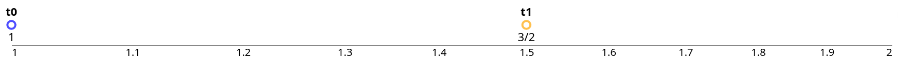
</p\>

From Principle 3, it is enough to select tones within the range of one octave—in our notation, tones with ratios in the range [1, 2). We can generate other tones from our minimalistic scale by applying octave circularity, multiplying our initial tones by {{ katex(body="2^n") }} where {{ katex(body="n \in \mathbf{Z}") }}.

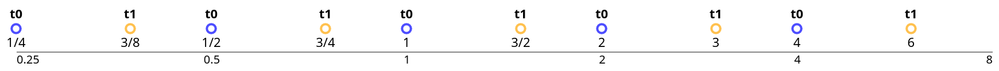

Having just two tones makes for a poor scale, so let's explore how to add more tones.

## Approach 1: What if {{ katex(body="t\_2") }} is good enough?

Let us assume that {{ katex(body="\frac{3}{2}") }} is such a good ratio that we only need to work with it. How can we extend our minimalistic 2-tone scale? We can multiply {{ katex(body="\frac{3}{2}") }} by {{ katex(body="\frac{3}{2}") }} again to get {{ katex(body="\frac{9}{4}") }}, which will be our next tone, {{ katex(body="t_2") }}.

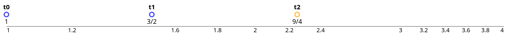

Since {{ katex(body="\frac{9}{4}") }} falls outside the interval [1, 2), we use octave circularity and fix it by dividing by 2, getting a value of {{ katex(body="\frac{9}{8}") }} that is inside the interval. In the following figure, the blue arrow represents division by 2; the orange arrows represent multiplication by {{ katex(body="\frac{3}{2}") }}.

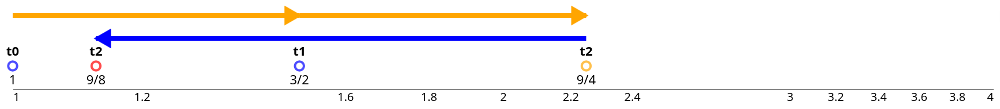
</p\>

This gives us a procedure for creating additional tones for our scale. We will take a power of {{ katex(body="\frac{3}{2}") }} and divide it by 2 enough times to get it into the interval [1, 2). The following picture shows how we get {{ katex(body="t_3") }}, i.e., {{ katex(body="\frac{(\frac{3}{2})^3}{2}") }}.

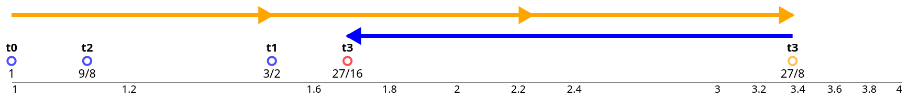

Note that we may need to divide by {{ katex(body="2") }} several times for larger numbers, e.g., {{ katex(body="t_4 = \frac{(\frac{3}{2})^4}{2^2}") }}. Therefore, you can see two blue arrows in the following figure.

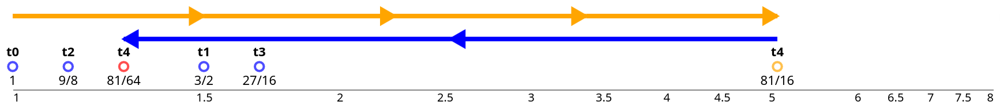

Using this approach, we generate more and more tones. Let's do it up to {{ katex(body="t_{11}") }} and we get our scale:

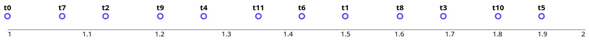

You may wonder why we stopped at {{ katex(body="t_{11}") }}. Let's look at what happens for {{ katex(body="t_{12}") }}:

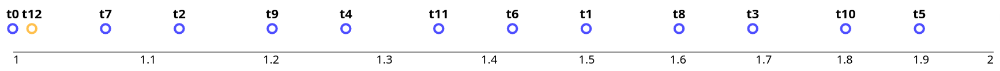

{{ katex(body="t_{12}") }} is very close to {{katex(body="t_{0}")}}. The reason is that {{ katex(body="(\frac{3}{2})^{12} = \frac{531441}{4096} \approx 129.75") }}. This number is very close to {{ katex(body="128 = 2^7") }}. So when we are dividing by 2 seven times, we eventually get a value relatively close to 1.

Because of this, generating new tones this way would basically be starting over from scratch and generating tones similar to the previous steps ({{ katex(body="t_{i}") }} and {{ katex(body="t_{i+12}") }} are close together).

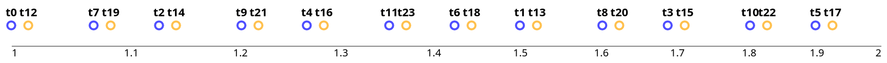

So this is it. We have created our first non-trivial scale: {{katex(body="t_{0}, \dots, t_{11}")}}. We will name it **Scale 0**. Let's summarize its properties:

* It is quite evenly distributed across the interval [1, 2).
* Tones {{katex(body="t_{i}")}} and {{katex(body="t_{i+1}")}} (in order of generation) always have a ratio of {{katex(body="\frac{3}{2}")}} or {{katex(body="\frac{3}{4}")}} (i.e., {{ katex(body="\frac{3}{2}") }} moved by an octave). 
  
Specifically:
{{katex(body="\frac{t_1}{t_0} = \frac{3}{2}")}},
{{katex(body="\frac{t_2}{t_1} = \frac{3}{4}")}},
{{katex(body="\frac{t_3}{t_2} = \frac{3}{2}")}},
{{katex(body="\frac{t_4}{t_3} = \frac{3}{4}")}},
{{katex(body="\frac{t_5}{t_4} = \frac{3}{2}")}},
{{katex(body="\frac{t_6}{t_5} = \frac{3}{4}")}},
{{katex(body="\frac{t_7}{t_6} = \frac{3}{4}")}},
{{katex(body="\frac{t_8}{t_7} = \frac{3}{2}")}},
{{katex(body="\frac{t_9}{t_8} = \frac{3}{4}")}},
{{katex(body="\frac{t_{10}}{t_{9}} = \frac{3}{2}")}},
{{katex(body="\frac{t_{11}}{t_{10}} = \frac{3}{4}")}}.

We can visualize this as follows. Yellow arrows are multiplication by {{katex(body="\frac{3}{2}")}}. Blue arrows are multiplication by {{katex(body="\frac{3}{4}")}}.

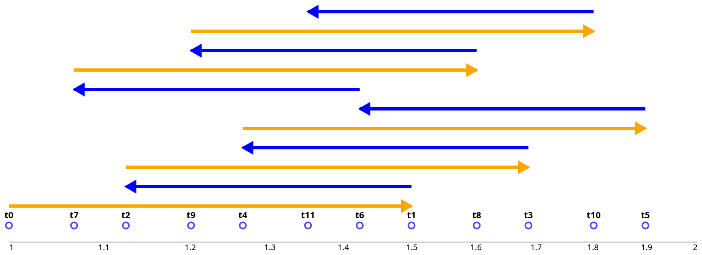

On the other hand, Scale 0 has some problematic properties. If we look at the ratios with respect to the initial tone {{katex(body="t\_0=1")}}:

{{katex(body="t_1 = \frac{3}{2}")}}, 
{{katex(body="t_2 = \frac{9}{8}")}},
{{katex(body="t_3 = \frac{27}{16}")}},
{{katex(body="t_4 = \frac{81}{64}")}},
{{katex(body="t_5 = \frac{243}{128}")}},
{{katex(body="t_6 = \frac{729}{512}")}},
{{katex(body="t_7 = \frac{2187}{2048}")}},
{{katex(body="t_8 = \frac{6561}{4096}")}},
{{katex(body="t_9 = \frac{19683}{16384}")}},
{{katex(body="t_{10} = \frac{59049}{32768}")}},
{{katex(body="t_{11} = \frac{177147}{131072}")}},

The ratios between consecutive notes in the sorted scale are {{katex(body="\\frac{256}{243}")}} and {{katex(body="\\frac{2187}{2048}")}}. The former is the yellow arrow and the latter is the blue arrow in the following image:

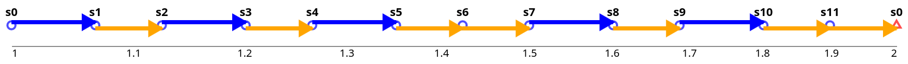

The large numbers in these ratios are a problem according to Principle 4. In the next section, we can try to fix this.

## Approach 2: Define goals, then search

In Approach 1 we have defined a procedure that generates a scale and then we observed the properties. We can we turn it over and we define the desired properties of the scale and then try to find ratios that best match these conditions.

We define the following conditions that resulting scale has to hold:

* We are finding 7 tones (Principle 5c)
* Ratios can be factored only by 2, 3, 5 (Principle 5a)
* Each tone is part of a triplet which members is also part of the scale and have ratios 4:5:6. (Principle 5b)
* Ratios in the scale has to have denominator at most 100. This is generally motivated by Principle 4, but constant 100 is an arbitrary choice to get some bounds on the searched space of ratios.

Among all solutions that hold the condition above, we are picking these that has:

* (primary criterium) maximal evenness across the interval [1, 2)
* (secondary criterium) minimize the maximal denominator that occurs in pairwise ratio of two ratios in the scale.

Before we continue, let us clarify the primary optimization criterion. For optimization of spread we need to be able to measure a distance. It would be a bad idea to e.g. compute distance of two ratios a, b as {{ katex(body="a-b") }}. Since we are on a log scale use {{ katex(body="\log_2(a) - \log_2(b) = \log_2(\frac{a}{b})") }}. 

We define *evennness of a scale* as the square distance between consecutive points. For this computation, we also add {{ katex(body="\frac{2}{1}") }} into the set, so we are also measuring the distance between the highest ratio in the scale to the next octave.

Now if we create a simple program that runs through all combinations of fractions and find the optimal one, we get:

{{ katex(body="1, \frac{9}{8},\frac{5}{4}, \frac{4}{3}, \frac{3}{2}, \frac{5}{3}, \frac{15}{8}")}}

Let us call it **Scale1**. This scale is actually used commonly in western music. If we look at pairwise fractions, the worst denominator is 45, which is much better than 131072 that we have seen in the previous approach.

<table style="border-collapse: collapse; margin: 20px auto;">
 <thead>
 <tr style="background-color: #2c5aa0; color: white;">
 <th style="border: 1px solid #ddd; padding: 12px; text-align: center; font-weight: bold;"></th>
 <th style="border: 1px solid #ddd; padding: 12px; text-align: center; font-weight: bold;">{{ katex(body="1") }}</th>
 <th style="border: 1px solid #ddd; padding: 12px; text-align: center; font-weight: bold;">{{ katex(body="\frac{9}{8}") }}</th>
 <th style="border: 1px solid #ddd; padding: 12px; text-align: center; font-weight: bold;">{{ katex(body="\frac{5}{4}") }}</th>
 <th style="border: 1px solid #ddd; padding: 12px; text-align: center; font-weight: bold;">{{ katex(body="\frac{4}{3}") }}</th>
 <th style="border: 1px solid #ddd; padding: 12px; text-align: center; font-weight: bold;">{{ katex(body="\frac{3}{2}") }}</th>
 <th style="border: 1px solid #ddd; padding: 12px; text-align: center; font-weight: bold;">{{ katex(body="\frac{5}{3}") }}</th>
 <th style="border: 1px solid #ddd; padding: 12px; text-align: center; font-weight: bold;">{{ katex(body="\frac{15}{8}") }}</th>
 <th style="border: 1px solid #ddd; padding: 12px; text-align: center; font-weight: bold;">{{ katex(body="2") }}</th>
 </tr>
 </thead>
 <tbody>
 <tr style="background-color: #fff;">
 <td style="border: 1px solid #ddd; padding: 12px; text-align: center; font-weight: bold; background-color: #2c5aa0; color: white;">{{ katex(body="1") }}</td>
 <td style="border: 1px solid #ddd; padding: 12px; text-align: center;">{{ katex(body="1") }}</td>
 <td style="border: 1px solid #ddd; padding: 12px; text-align: center;">{{ katex(body="\frac{8}{9}") }}</td>
 <td style="border: 1px solid #ddd; padding: 12px; text-align: center;">{{ katex(body="\frac{4}{5}") }}</td>
 <td style="border: 1px solid #ddd; padding: 12px; text-align: center;">{{ katex(body="\frac{3}{4}") }}</td>
 <td style="border: 1px solid #ddd; padding: 12px; text-align: center;">{{ katex(body="\frac{2}{3}") }}</td>
 <td style="border: 1px solid #ddd; padding: 12px; text-align: center;">{{ katex(body="\frac{3}{5}") }}</td>
 <td style="border: 1px solid #ddd; padding: 12px; text-align: center;">{{ katex(body="\frac{8}{15}") }}</td>
 <td style="border: 1px solid #ddd; padding: 12px; text-align: center;">{{ katex(body="\frac{1}{2}") }}</td>
 </tr>
 <tr style="background-color: #f9f9f9;">
 <td style="border: 1px solid #ddd; padding: 12px; text-align: center; font-weight: bold; background-color: #2c5aa0; color: white;">{{ katex(body="\frac{9}{8}") }}</td>
 <td style="border: 1px solid #ddd; padding: 12px; text-align: center;">{{ katex(body="\frac{9}{8}") }}</td>
 <td style="border: 1px solid #ddd; padding: 12px; text-align: center;">{{ katex(body="1") }}</td>
 <td style="border: 1px solid #ddd; padding: 12px; text-align: center;">{{ katex(body="\frac{9}{10}") }}</td>
 <td style="border: 1px solid #ddd; padding: 12px; text-align: center;">{{ katex(body="\frac{27}{32}") }}</td>
 <td style="border: 1px solid #ddd; padding: 12px; text-align: center;">{{ katex(body="\frac{3}{4}") }}</td>
 <td style="border: 1px solid #ddd; padding: 12px; text-align: center;">{{ katex(body="\frac{27}{40}") }}</td>
 <td style="border: 1px solid #ddd; padding: 12px; text-align: center;">{{ katex(body="\frac{3}{5}") }}</td>
 <td style="border: 1px solid #ddd; padding: 12px; text-align: center;">{{ katex(body="\frac{9}{16}") }}</td>
 </tr>
 <tr style="background-color: #fff;">
 <td style="border: 1px solid #ddd; padding: 12px; text-align: center; font-weight: bold; background-color: #2c5aa0; color: white;">{{ katex(body="\frac{5}{4}") }}</td>
 <td style="border: 1px solid #ddd; padding: 12px; text-align: center;">{{ katex(body="\frac{5}{4}") }}</td>
 <td style="border: 1px solid #ddd; padding: 12px; text-align: center;">{{ katex(body="\frac{10}{9}") }}</td>
 <td style="border: 1px solid #ddd; padding: 12px; text-align: center;">{{ katex(body="1") }}</td>
 <td style="border: 1px solid #ddd; padding: 12px; text-align: center;">{{ katex(body="\frac{15}{16}") }}</td>
 <td style="border: 1px solid #ddd; padding: 12px; text-align: center;">{{ katex(body="\frac{5}{6}") }}</td>
 <td style="border: 1px solid #ddd; padding: 12px; text-align: center;">{{ katex(body="\frac{3}{4}") }}</td>
 <td style="border: 1px solid #ddd; padding: 12px; text-align: center;">{{ katex(body="\frac{2}{3}") }}</td>
 <td style="border: 1px solid #ddd; padding: 12px; text-align: center;">{{ katex(body="\frac{5}{8}") }}</td>
 </tr>
 <tr style="background-color: #f9f9f9;">
 <td style="border: 1px solid #ddd; padding: 12px; text-align: center; font-weight: bold; background-color: #2c5aa0; color: white;">{{ katex(body="\frac{4}{3}") }}</td>
 <td style="border: 1px solid #ddd; padding: 12px; text-align: center;">{{ katex(body="\frac{4}{3}") }}</td>
 <td style="border: 1px solid #ddd; padding: 12px; text-align: center;">{{ katex(body="\frac{32}{27}") }}</td>
 <td style="border: 1px solid #ddd; padding: 12px; text-align: center;">{{ katex(body="\frac{16}{15}") }}</td>
 <td style="border: 1px solid #ddd; padding: 12px; text-align: center;">{{ katex(body="1") }}</td>
 <td style="border: 1px solid #ddd; padding: 12px; text-align: center;">{{ katex(body="\frac{8}{9}") }}</td>
 <td style="border: 1px solid #ddd; padding: 12px; text-align: center;">{{ katex(body="\frac{4}{5}") }}</td>
 <td style="border: 1px solid #ddd; padding: 12px; text-align: center;">{{ katex(body="\frac{32}{45}") }}</td>
 <td style="border: 1px solid #ddd; padding: 12px; text-align: center;">{{ katex(body="\frac{2}{3}") }}</td>
 </tr>
 <tr style="background-color: #fff;">
 <td style="border: 1px solid #ddd; padding: 12px; text-align: center; font-weight: bold; background-color: #2c5aa0; color: white;">{{ katex(body="\frac{3}{2}") }}</td>
 <td style="border: 1px solid #ddd; padding: 12px; text-align: center;">{{ katex(body="\frac{3}{2}") }}</td>
 <td style="border: 1px solid #ddd; padding: 12px; text-align: center;">{{ katex(body="\frac{4}{3}") }}</td>
 <td style="border: 1px solid #ddd; padding: 12px; text-align: center;">{{ katex(body="\frac{6}{5}") }}</td>
 <td style="border: 1px solid #ddd; padding: 12px; text-align: center;">{{ katex(body="\frac{9}{8}") }}</td>
 <td style="border: 1px solid #ddd; padding: 12px; text-align: center;">{{ katex(body="1") }}</td>
 <td style="border: 1px solid #ddd; padding: 12px; text-align: center;">{{ katex(body="\frac{9}{10}") }}</td>
 <td style="border: 1px solid #ddd; padding: 12px; text-align: center;">{{ katex(body="\frac{4}{5}") }}</td>
 <td style="border: 1px solid #ddd; padding: 12px; text-align: center;">{{ katex(body="\frac{3}{4}") }}</td>
 </tr>
 <tr style="background-color: #f9f9f9;">
 <td style="border: 1px solid #ddd; padding: 12px; text-align: center; font-weight: bold; background-color: #2c5aa0; color: white;">{{ katex(body="\frac{5}{3}") }}</td>
 <td style="border: 1px solid #ddd; padding: 12px; text-align: center;">{{ katex(body="\frac{5}{3}") }}</td>
 <td style="border: 1px solid #ddd; padding: 12px; text-align: center;">{{ katex(body="\frac{40}{27}") }}</td>
 <td style="border: 1px solid #ddd; padding: 12px; text-align: center;">{{ katex(body="\frac{4}{3}") }}</td>
 <td style="border: 1px solid #ddd; padding: 12px; text-align: center;">{{ katex(body="\frac{5}{4}") }}</td>
 <td style="border: 1px solid #ddd; padding: 12px; text-align: center;">{{ katex(body="\frac{10}{9}") }}</td>
 <td style="border: 1px solid #ddd; padding: 12px; text-align: center;">{{ katex(body="1") }}</td>
 <td style="border: 1px solid #ddd; padding: 12px; text-align: center;">{{ katex(body="\frac{8}{9}") }}</td>
 <td style="border: 1px solid #ddd; padding: 12px; text-align: center;">{{ katex(body="\frac{5}{6}") }}</td>
 </tr>
 <tr style="background-color: #fff;">
 <td style="border: 1px solid #ddd; padding: 12px; text-align: center; font-weight: bold; background-color: #2c5aa0; color: white;">{{ katex(body="\frac{15}{8}") }}</td>
 <td style="border: 1px solid #ddd; padding: 12px; text-align: center;">{{ katex(body="\frac{15}{8}") }}</td>
 <td style="border: 1px solid #ddd; padding: 12px; text-align: center;">{{ katex(body="\frac{5}{3}") }}</td>
 <td style="border: 1px solid #ddd; padding: 12px; text-align: center;">{{ katex(body="\frac{3}{2}") }}</td>
 <td style="border: 1px solid #ddd; padding: 12px; text-align: center;">{{ katex(body="\frac{45}{32}") }}</td>
 <td style="border: 1px solid #ddd; padding: 12px; text-align: center;">{{ katex(body="\frac{5}{4}") }}</td>
 <td style="border: 1px solid #ddd; padding: 12px; text-align: center;">{{ katex(body="\frac{9}{8}") }}</td>
 <td style="border: 1px solid #ddd; padding: 12px; text-align: center;">{{ katex(body="1") }}</td>
 <td style="border: 1px solid #ddd; padding: 12px; text-align: center;">{{ katex(body="\frac{15}{16}") }}</td>
 </tr>
 <tr style="background-color: #f9f9f9;">
 <td style="border: 1px solid #ddd; padding: 12px; text-align: center; font-weight: bold; background-color: #2c5aa0; color: white;">{{ katex(body="2") }}</td>
 <td style="border: 1px solid #ddd; padding: 12px; text-align: center;">{{ katex(body="2") }}</td>
 <td style="border: 1px solid #ddd; padding: 12px; text-align: center;">{{ katex(body="\frac{16}{9}") }}</td>
 <td style="border: 1px solid #ddd; padding: 12px; text-align: center;">{{ katex(body="\frac{8}{5}") }}</td>
 <td style="border: 1px solid #ddd; padding: 12px; text-align: center;">{{ katex(body="\frac{3}{2}") }}</td>
 <td style="border: 1px solid #ddd; padding: 12px; text-align: center;">{{ katex(body="\frac{4}{3}") }}</td>
 <td style="border: 1px solid #ddd; padding: 12px; text-align: center;">{{ katex(body="\frac{6}{5}") }}</td>
 <td style="border: 1px solid #ddd; padding: 12px; text-align: center;">{{ katex(body="\frac{16}{15}") }}</td>
 <td style="border: 1px solid #ddd; padding: 12px; text-align: center;">{{ katex(body="1") }}</td>
 </tr>
 </tbody>
</table>

In construction of Scale 1, we have used we have utilized only the first triplet from Principle 5b (the third condition for our scale).
What if we would allow also the second triplet? Then the result would be the same and 
we also obtain Scale 1. What if we *only* the second triplet (10:12:15)? Then the situation becomes slightly more complex.

We get two optimal results:

A) {{ katex(body="1, \frac{16}{15}, \frac{6}{5}, \frac{4}{3}, \frac{3}{2}, \frac{8}{5}, \frac{16}{9}") }}

B) {{ katex(body="1, \frac{9}{8}, \frac{6}{5}, \frac{27}{20}, \frac{3}{2}, \frac{27}{16}, \frac{9}{5}") }}

Both of them also have 45 as the worst pairwise denominator.  The (A) is again a well recognized scale. 
For (B), I was not able to find any information about practical usage. My guess is that {{ katex(body="\frac{27}{20}") }} and {{ katex(body="\frac{27}{16}") }} is not a good ratio for basic ratio in scale.

But following a cultural tradition of the western music, we will use a crossover between (A) and (B).

{{ katex(body="1, \frac{9}{8}, \frac{6}{5}, \frac{4}{3}, \frac{3}{2}, \frac{8}{5}, \frac{9}{5}") }}

Let us call it **Scale 2**. It is actually the second best solution for our optimization process right behind (A), and (B).  It has the same evenness as (A) and (B) but it has a slightly worse the worst pairwise denominator: 64.

<table style="border-collapse: collapse; margin: 20px auto;">
 <thead>
 <tr style="background-color: #2c5aa0; color: white;">
 <th style="border: 1px solid #ddd; padding: 12px; text-align: center; font-weight: bold;"></th>
 <th style="border: 1px solid #ddd; padding: 12px; text-align: center; font-weight: bold;">{{ katex(body="1") }}</th>
 <th style="border: 1px solid #ddd; padding: 12px; text-align: center; font-weight: bold;">{{ katex(body="\frac{9}{8}") }}</th>
 <th style="border: 1px solid #ddd; padding: 12px; text-align: center; font-weight: bold;">{{ katex(body="\frac{6}{5}") }}</th>
 <th style="border: 1px solid #ddd; padding: 12px; text-align: center; font-weight: bold;">{{ katex(body="\frac{4}{3}") }}</th>
 <th style="border: 1px solid #ddd; padding: 12px; text-align: center; font-weight: bold;">{{ katex(body="\frac{3}{2}") }}</th>
 <th style="border: 1px solid #ddd; padding: 12px; text-align: center; font-weight: bold;">{{ katex(body="\frac{8}{5}") }}</th>
 <th style="border: 1px solid #ddd; padding: 12px; text-align: center; font-weight: bold;">{{ katex(body="\frac{9}{5}") }}</th>
 <th style="border: 1px solid #ddd; padding: 12px; text-align: center; font-weight: bold;">{{ katex(body="2") }}</th>
 </tr>
 </thead>
 <tbody>
 <tr style="background-color: #fff;">
 <td style="border: 1px solid #ddd; padding: 12px; text-align: center; font-weight: bold; background-color: #2c5aa0; color: white;">{{ katex(body="1") }}</td>
 <td style="border: 1px solid #ddd; padding: 12px; text-align: center;">{{ katex(body="1") }}</td>
 <td style="border: 1px solid #ddd; padding: 12px; text-align: center;">{{ katex(body="\frac{8}{9}") }}</td>
 <td style="border: 1px solid #ddd; padding: 12px; text-align: center;">{{ katex(body="\frac{5}{6}") }}</td>
 <td style="border: 1px solid #ddd; padding: 12px; text-align: center;">{{ katex(body="\frac{3}{4}") }}</td>
 <td style="border: 1px solid #ddd; padding: 12px; text-align: center;">{{ katex(body="\frac{2}{3}") }}</td>
 <td style="border: 1px solid #ddd; padding: 12px; text-align: center;">{{ katex(body="\frac{5}{8}") }}</td>
 <td style="border: 1px solid #ddd; padding: 12px; text-align: center;">{{ katex(body="\frac{5}{9}") }}</td>
 <td style="border: 1px solid #ddd; padding: 12px; text-align: center;">{{ katex(body="\frac{1}{2}") }}</td>
 </tr>
 <tr style="background-color: #f9f9f9;">
 <td style="border: 1px solid #ddd; padding: 12px; text-align: center; font-weight: bold; background-color: #2c5aa0; color: white;">{{ katex(body="\frac{9}{8}") }}</td>
 <td style="border: 1px solid #ddd; padding: 12px; text-align: center;">{{ katex(body="\frac{9}{8}") }}</td>
 <td style="border: 1px solid #ddd; padding: 12px; text-align: center;">{{ katex(body="1") }}</td>
 <td style="border: 1px solid #ddd; padding: 12px; text-align: center;">{{ katex(body="\frac{15}{16}") }}</td>
 <td style="border: 1px solid #ddd; padding: 12px; text-align: center;">{{ katex(body="\frac{27}{32}") }}</td>
 <td style="border: 1px solid #ddd; padding: 12px; text-align: center;">{{ katex(body="\frac{3}{4}") }}</td>
 <td style="border: 1px solid #ddd; padding: 12px; text-align: center;">{{ katex(body="\frac{45}{64}") }}</td>
 <td style="border: 1px solid #ddd; padding: 12px; text-align: center;">{{ katex(body="\frac{5}{8}") }}</td>
 <td style="border: 1px solid #ddd; padding: 12px; text-align: center;">{{ katex(body="\frac{9}{16}") }}</td>
 </tr>
 <tr style="background-color: #fff;">
 <td style="border: 1px solid #ddd; padding: 12px; text-align: center; font-weight: bold; background-color: #2c5aa0; color: white;">{{ katex(body="\frac{6}{5}") }}</td>
 <td style="border: 1px solid #ddd; padding: 12px; text-align: center;">{{ katex(body="\frac{6}{5}") }}</td>
 <td style="border: 1px solid #ddd; padding: 12px; text-align: center;">{{ katex(body="\frac{16}{15}") }}</td>
 <td style="border: 1px solid #ddd; padding: 12px; text-align: center;">{{ katex(body="1") }}</td>
 <td style="border: 1px solid #ddd; padding: 12px; text-align: center;">{{ katex(body="\frac{9}{10}") }}</td>
 <td style="border: 1px solid #ddd; padding: 12px; text-align: center;">{{ katex(body="\frac{4}{5}") }}</td>
 <td style="border: 1px solid #ddd; padding: 12px; text-align: center;">{{ katex(body="\frac{3}{4}") }}</td>
 <td style="border: 1px solid #ddd; padding: 12px; text-align: center;">{{ katex(body="\frac{2}{3}") }}</td>
 <td style="border: 1px solid #ddd; padding: 12px; text-align: center;">{{ katex(body="\frac{3}{5}") }}</td>
 </tr>
 <tr style="background-color: #f9f9f9;">
 <td style="border: 1px solid #ddd; padding: 12px; text-align: center; font-weight: bold; background-color: #2c5aa0; color: white;">{{ katex(body="\frac{4}{3}") }}</td>
 <td style="border: 1px solid #ddd; padding: 12px; text-align: center;">{{ katex(body="\frac{4}{3}") }}</td>
 <td style="border: 1px solid #ddd; padding: 12px; text-align: center;">{{ katex(body="\frac{32}{27}") }}</td>
 <td style="border: 1px solid #ddd; padding: 12px; text-align: center;">{{ katex(body="\frac{10}{9}") }}</td>
 <td style="border: 1px solid #ddd; padding: 12px; text-align: center;">{{ katex(body="1") }}</td>
 <td style="border: 1px solid #ddd; padding: 12px; text-align: center;">{{ katex(body="\frac{8}{9}") }}</td>
 <td style="border: 1px solid #ddd; padding: 12px; text-align: center;">{{ katex(body="\frac{5}{6}") }}</td>
 <td style="border: 1px solid #ddd; padding: 12px; text-align: center;">{{ katex(body="\frac{20}{27}") }}</td>
 <td style="border: 1px solid #ddd; padding: 12px; text-align: center;">{{ katex(body="\frac{2}{3}") }}</td>
 </tr>
 <tr style="background-color: #fff;">
 <td style="border: 1px solid #ddd; padding: 12px; text-align: center; font-weight: bold; background-color: #2c5aa0; color: white;">{{ katex(body="\frac{3}{2}") }}</td>
 <td style="border: 1px solid #ddd; padding: 12px; text-align: center;">{{ katex(body="\frac{3}{2}") }}</td>
 <td style="border: 1px solid #ddd; padding: 12px; text-align: center;">{{ katex(body="\frac{4}{3}") }}</td>
 <td style="border: 1px solid #ddd; padding: 12px; text-align: center;">{{ katex(body="\frac{5}{4}") }}</td>
 <td style="border: 1px solid #ddd; padding: 12px; text-align: center;">{{ katex(body="\frac{9}{8}") }}</td>
 <td style="border: 1px solid #ddd; padding: 12px; text-align: center;">{{ katex(body="1") }}</td>
 <td style="border: 1px solid #ddd; padding: 12px; text-align: center;">{{ katex(body="\frac{15}{16}") }}</td>
 <td style="border: 1px solid #ddd; padding: 12px; text-align: center;">{{ katex(body="\frac{5}{6}") }}</td>
 <td style="border: 1px solid #ddd; padding: 12px; text-align: center;">{{ katex(body="\frac{3}{4}") }}</td>
 </tr>
 <tr style="background-color: #f9f9f9;">
 <td style="border: 1px solid #ddd; padding: 12px; text-align: center; font-weight: bold; background-color: #2c5aa0; color: white;">{{ katex(body="\frac{8}{5}") }}</td>
 <td style="border: 1px solid #ddd; padding: 12px; text-align: center;">{{ katex(body="\frac{8}{5}") }}</td>
 <td style="border: 1px solid #ddd; padding: 12px; text-align: center;">{{ katex(body="\frac{64}{45}") }}</td>
 <td style="border: 1px solid #ddd; padding: 12px; text-align: center;">{{ katex(body="\frac{4}{3}") }}</td>
 <td style="border: 1px solid #ddd; padding: 12px; text-align: center;">{{ katex(body="\frac{6}{5}") }}</td>
 <td style="border: 1px solid #ddd; padding: 12px; text-align: center;">{{ katex(body="\frac{16}{15}") }}</td>
 <td style="border: 1px solid #ddd; padding: 12px; text-align: center;">{{ katex(body="1") }}</td>
 <td style="border: 1px solid #ddd; padding: 12px; text-align: center;">{{ katex(body="\frac{8}{9}") }}</td>
 <td style="border: 1px solid #ddd; padding: 12px; text-align: center;">{{ katex(body="\frac{4}{5}") }}</td>
 </tr>
 <tr style="background-color: #fff;">
 <td style="border: 1px solid #ddd; padding: 12px; text-align: center; font-weight: bold; background-color: #2c5aa0; color: white;">{{ katex(body="\frac{9}{5}") }}</td>
 <td style="border: 1px solid #ddd; padding: 12px; text-align: center;">{{ katex(body="\frac{9}{5}") }}</td>
 <td style="border: 1px solid #ddd; padding: 12px; text-align: center;">{{ katex(body="\frac{8}{5}") }}</td>
 <td style="border: 1px solid #ddd; padding: 12px; text-align: center;">{{ katex(body="\frac{3}{2}") }}</td>
 <td style="border: 1px solid #ddd; padding: 12px; text-align: center;">{{ katex(body="\frac{27}{20}") }}</td>
 <td style="border: 1px solid #ddd; padding: 12px; text-align: center;">{{ katex(body="\frac{6}{5}") }}</td>
 <td style="border: 1px solid #ddd; padding: 12px; text-align: center;">{{ katex(body="\frac{9}{8}") }}</td>
 <td style="border: 1px solid #ddd; padding: 12px; text-align: center;">{{ katex(body="1") }}</td>
 <td style="border: 1px solid #ddd; padding: 12px; text-align: center;">{{ katex(body="\frac{9}{10}") }}</td>
 </tr>
 <tr style="background-color: #f9f9f9;">
 <td style="border: 1px solid #ddd; padding: 12px; text-align: center; font-weight: bold; background-color: #2c5aa0; color: white;">{{ katex(body="2") }}</td>
 <td style="border: 1px solid #ddd; padding: 12px; text-align: center;">{{ katex(body="2") }}</td>
 <td style="border: 1px solid #ddd; padding: 12px; text-align: center;">{{ katex(body="\frac{16}{9}") }}</td>
 <td style="border: 1px solid #ddd; padding: 12px; text-align: center;">{{ katex(body="\frac{5}{3}") }}</td>
 <td style="border: 1px solid #ddd; padding: 12px; text-align: center;">{{ katex(body="\frac{3}{2}") }}</td>
 <td style="border: 1px solid #ddd; padding: 12px; text-align: center;">{{ katex(body="\frac{4}{3}") }}</td>
 <td style="border: 1px solid #ddd; padding: 12px; text-align: center;">{{ katex(body="\frac{5}{4}") }}</td>
 <td style="border: 1px solid #ddd; padding: 12px; text-align: center;">{{ katex(body="\frac{10}{9}") }}</td>
 <td style="border: 1px solid #ddd; padding: 12px; text-align: center;">{{ katex(body="1") }}</td>
 </tr>
 </tbody>
</table>

As we have fixed our Scale 1 and Scale 2 and we can explore them more.

If we look of consecutive ratios between consecutive tones, we will see that repeat three ratios:

* {{ katex(body="\frac{16}{15}") }} (green)
* {{ katex(body="\frac{10}{9}") }} (blue)
* {{ katex(body="\frac{9}{8}") }} (orange)

Scale 1:

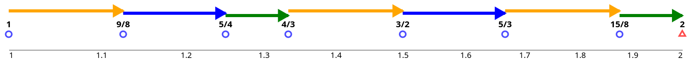

Scale 2:

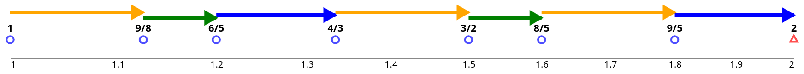

For completeness, let us also look at Scale (A):

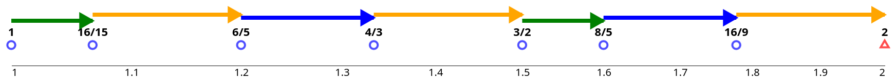

We can see that it has the same pattern as Scale 2, but shifted. If we start from {{ katex(body="\frac{3}{2}") }} in Scale 2 and cyclically write down the pattern, we get (A). 

Visually, you can observe that we have two kind of steps: long ones ({{ katex(body="\frac{10}{9}") }} and {{ katex(body="\frac{9}{8}") }}) and short one ({{ katex(body="\frac{16}{15}") }})
while the short one is about half in size of the long one. 
We can also check it numerically in log2 distance: {{ katex(body="\log_2(\frac{9}{8}) \approx 1.170, \log_2(\frac{10}{9}) \approx 1.152, \log_2(\frac{16}{15}) \approx 0.093") }}.

These different steps and shifts will be important in another part of this blog post serie. In this text, we will continue to generate one more scale.

---

### Approach 3: Equal Steps

In the previous two approaches we have seen that size of steps between consecutive tones varies.
Let's try to fix this. So our goal is to create a scale with n tones such that there is the equal distance between consecutive steps, i.e. when we want to get from {{ katex(body="s_i") }} to {{ katex(body="s_{i+1}") }} then we always multiply with the same constant c. Here is example with scale of 4 tones:

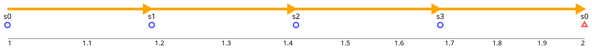

How do we compute the size of the step?  If we have 4 tones, we want to move 4 times to get 2 (= whole octave). This means that we are multiplying:

{{ katex(body="1 * c * c * c * c = 2") }}

that is

{{ katex(body="c^4 = 2") }}

so we get:

{{ katex(body="c = \sqrt[4]{2}") }}

if we abstract 4 to n tones we get:

{{ katex(body="c = \sqrt[n]{2}") }}

This result brings us a problem: for all n > 1: {{katex(body="\sqrt[n]{2}") }} is is not a rational number; i.e. the number cannot be expressed as a fraction {{ katex(body="\frac{a}{b}") }}. Therefore also all tones {{ katex(body="s_i, i >= 1") }} in such a generated scale will not be rational numbers.
Here saves us Principle 6. We do not need exact ratios, we just need to get close enough.

The question is now what n we should choose. 
For the beginning, let us say that we want to express {{ katex(body="\frac{3}{2}") }} very closely.
We can look on all scales where n ranges from [2..30] and look how close is the closest tone to {{ katex(body="\frac{3}{2}") }}.
(the range up to 30 is arbitrary, but having scale with more than 30 tones is probably impractical).

Let us plot the result:

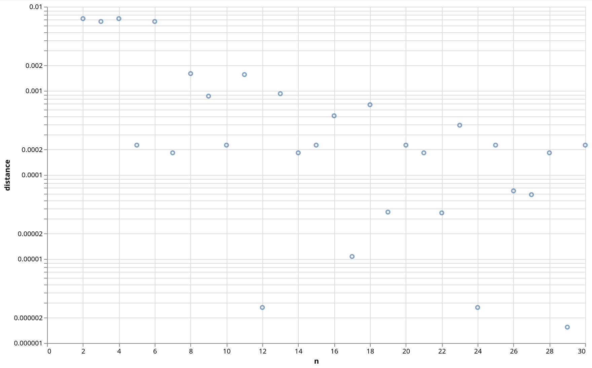

X-axis is the number of tones; Y-axis is squared log distance.
Note that Y-axis shown in log scale, so we are "zooming" on a smaller numbers. 

From the figure, we see that good candidates for "n" are: 12, 24, 29 tones. 
But we want to optimize not only for {{ katex(body="\frac{3}{2}") }} but also for other "good ratios". As good ratios, we take the union of ratios in Scale 1 and Scale 2. If we take mean squared distances to all of these ratios we get the the following figure:

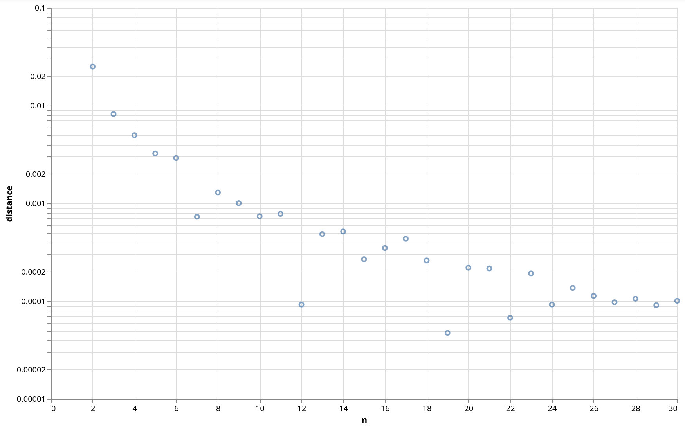

We can see that good candidates for "n” seems to be 12, 19, 22, 24, 27 and 29.

We choose n = 12 for compatability with Western music (it is aligned with Principle 5c).
Notes on other “n” values: People in history experiments 19 and 22 tones music scales. 24 tones is used in Middle East music. 27 and 29 seem to be consudered obscure and not praticaly used.

So our Scale 3 is defined as follows:

{{ katex(body="s_i = (\sqrt[12]{2})^i") }} for {{ katex(body="i \in {0, 1, \dots, 11}") }}

For comparison we plot all scales together: Scale 3 = orange circles, Scale 1 = blue triangles, Scale 2 = red crosses, and Scale 0 = green boxes.

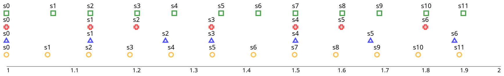

## Conclusion

We have derived four scales with different approaches and different properties. In the next part we explore the properties of large and small steps that occur in Scale 1 and 2.
