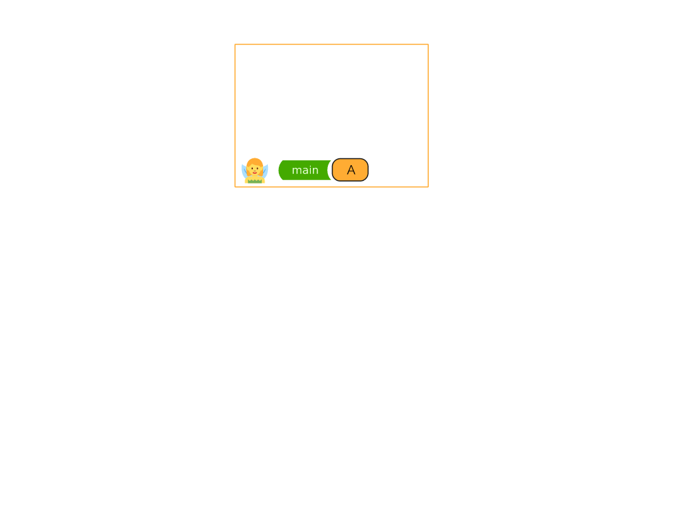
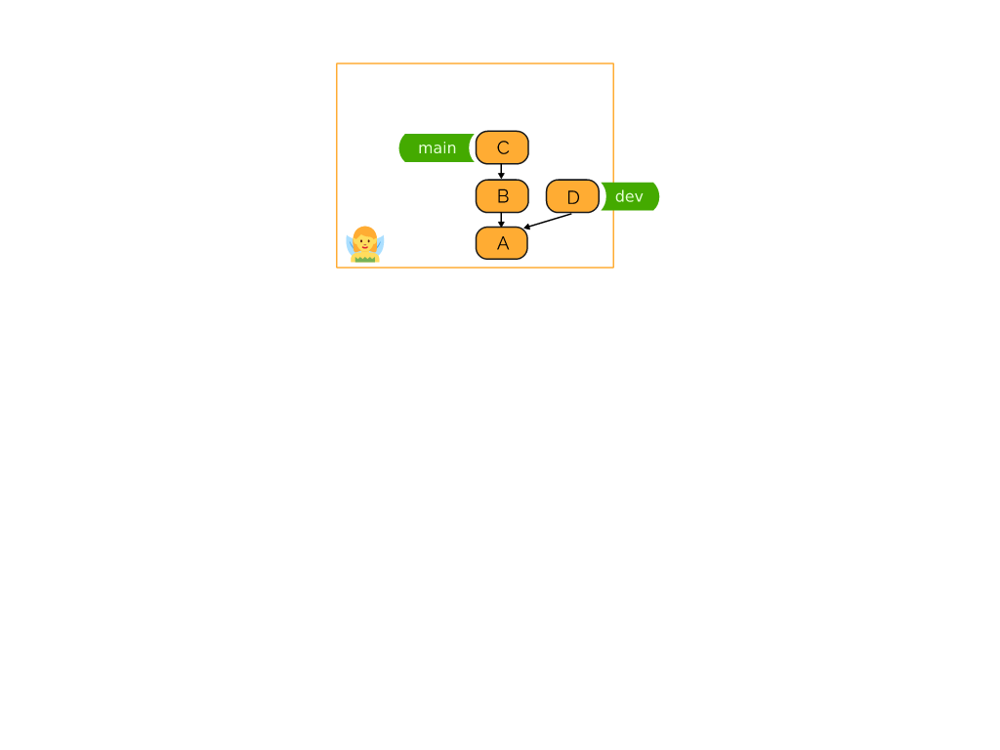
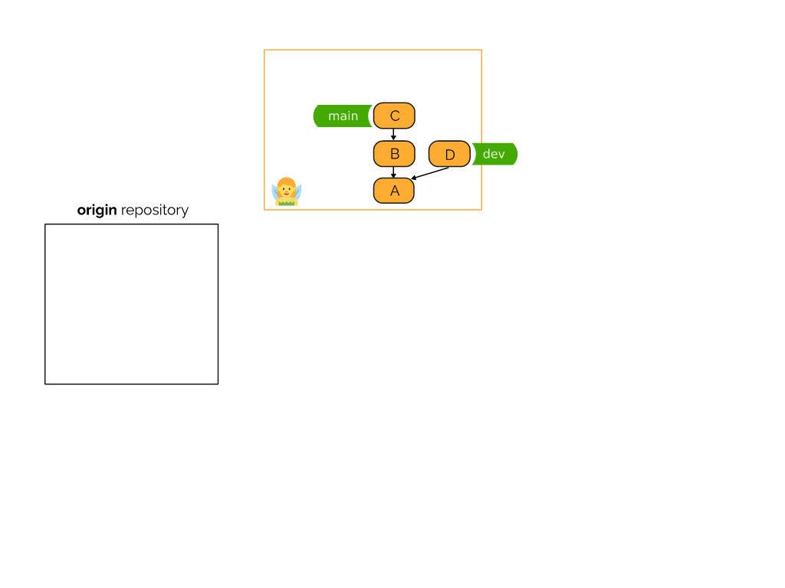
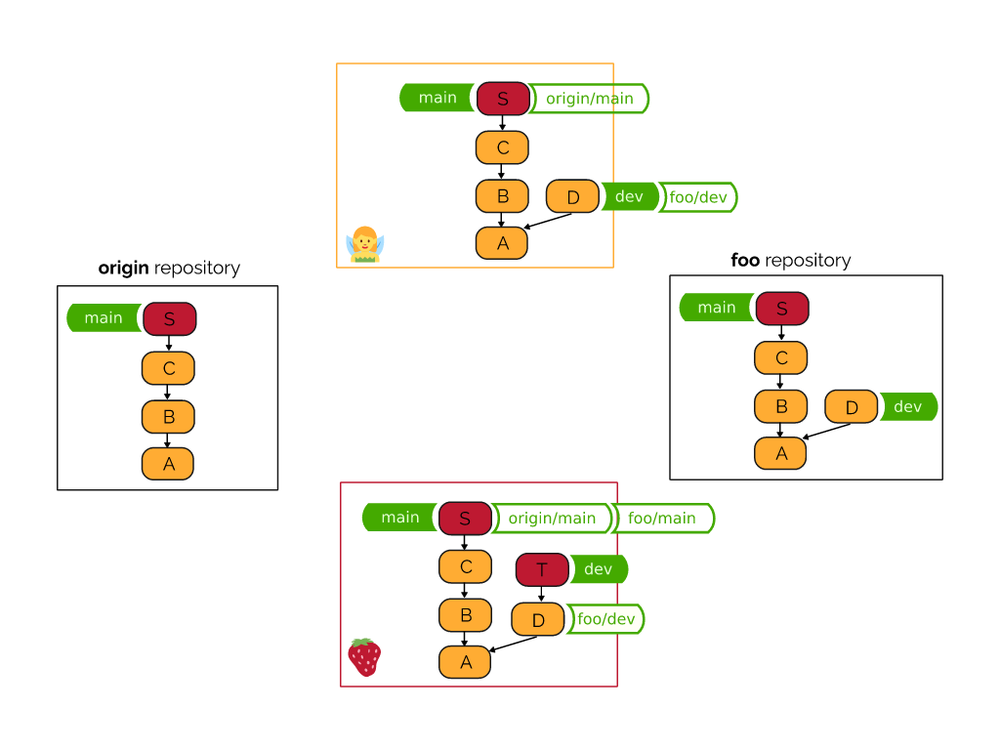
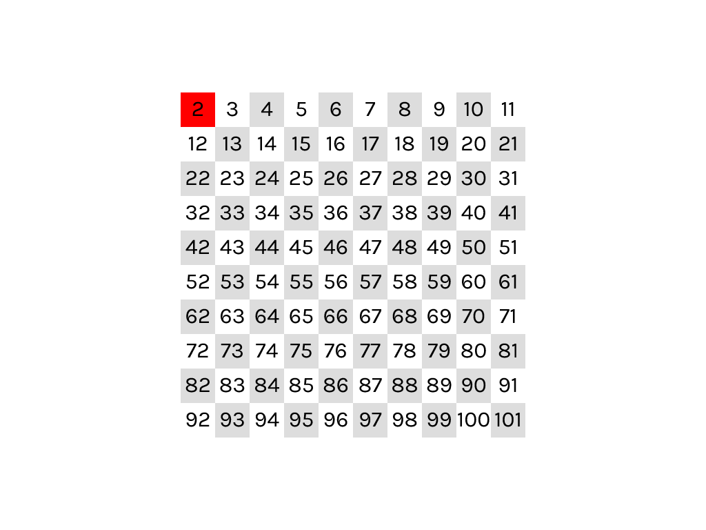
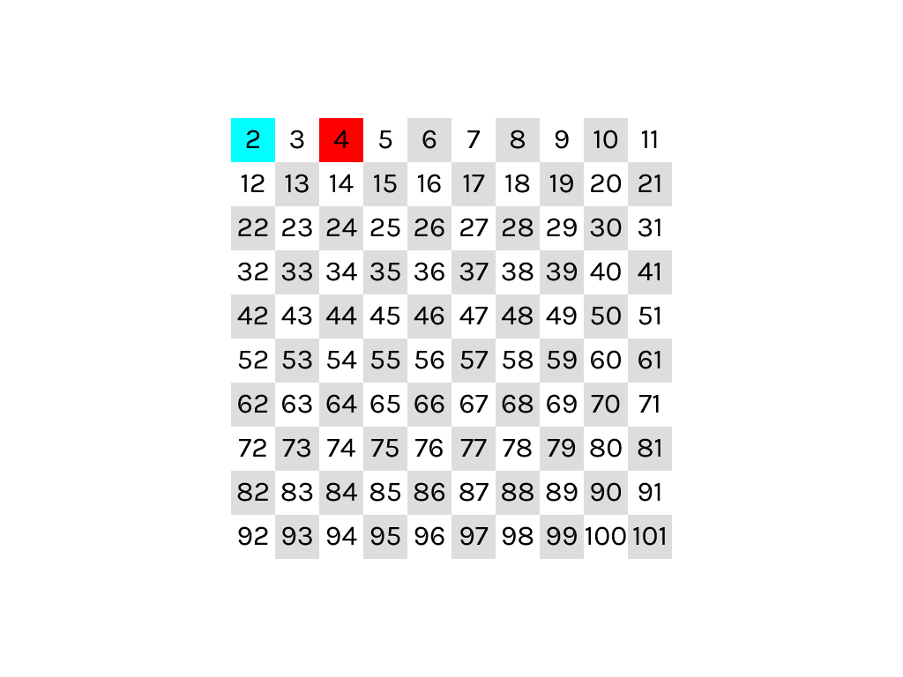
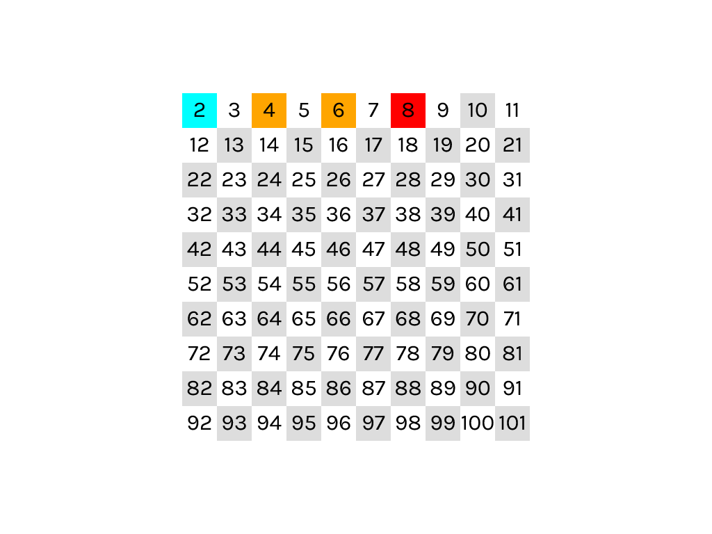
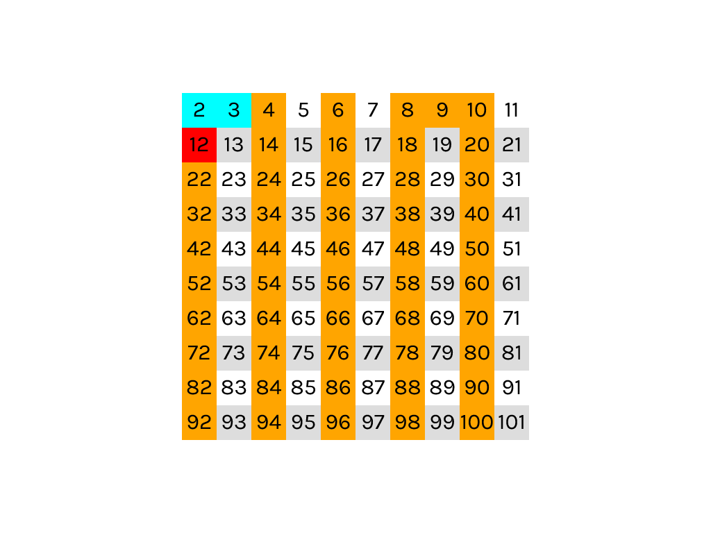
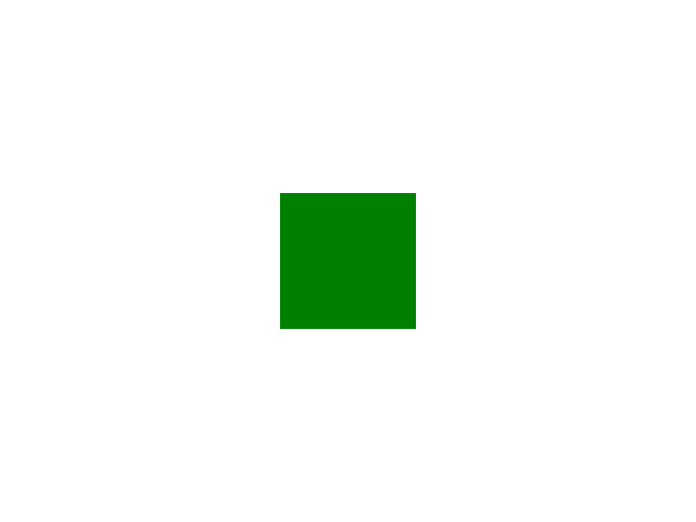

+++
title = "Nelsie: About Focus in Slides"
date = 2024-08-03
+++

In technical presentations, maintaining audience focus is crucial yet challenging. This blog post introduces [Nelsie](https://github.com/spirali/nelsie/), a tool designed for creating complex technical slides. I would like to share insights into why precise control over slide elements is essential and how Nelsie addresses this need.
Nelsie is a Python library with a Rust backend.


## The Problem of Information Overload

I will now use a slide from a presentation that
I have randomly found on SlideShare [[link]](https://www.slideshare.net/slideshow/quantum-gates-235545152/235545152). I have not seen the talk so this is not a critique of any particular talk. But let's assume that you are in the audience of a talk and now the following slide appears on screen.

<p class="center">

</p>

If you are not familiar with the Bloch sphere, you will need some time to orient yourself in the picture.

What will you do? People are used to reading from top to bottom and from left to right. So you read the title. And then what? Some people will try to follow the arrows, but they do not point in only one direction. Some people will try to read the scattered letters. Some people will probably decipher the rainbow title. What is the result? A room full of people, each focused on a different part of the slide, and the presenter has to spend some time getting them back in sync.


### Historical note

Let me note that the problem of loss of focus is amplified by the existence of slides, because if you make a classic presentation on a blackboard, you cannot create a complex figure in the blink of an eye.
You have to spend some time drawing the picture and
you have time to explain what you are drawing.

Consider the following image: Even though you have no context, you know where to focus your attention.

<p class="center">

</p>


## Slide story telling

A lot of advice on how to create a talk emphasizes that your talk has to tell a story. And this is true for your slides, even if you are presenting technical content.

Consider the following sample slides from my Git tutorial. This part explains how Git remote repositories works.
This is a fragment of the whole Git tutorial and the audience is already used to the fact that rectangles represent repositories; the icon in the corner is the user's avatar; rounded boxes represent commits.

* So let the story begin ... let us a have a fairy and her repository:
<p class="center">

</p>

* She creates a first commit into her `main` branch:
<p class="center">

</p>

* She adds two more commits, and `main` branch moves along with those changes. Note that a branch is basically a label to a tree of commits:
<p class="center">

</p>

* She also adds an experimental code in `dev` branch:
<p class="center">

</p>

* Now assume that there is a remote repository named `origin`:
<p class="center">

</p>

* Fairy will push her `main` branch into the `origin` repository:
<p class="center">

</p>

* Git copies commits into the history of `main` branch:
<p class="center">

</p>

* A branch `main` in the `origin` repository can be now established.
<p class="center">

</p>

* Local repository also remembers where `origin`'s `main` is pointing.
<p class="center">

</p>

And so on …

I will not go through the whole scenario. You can find the rest of the slides for this example in [this PDF](git.pdf) (36 slides).
This scenario ends with the following slide:

<p class="center">

</p>

If I were to show you this slide all at once then you would probably also need some time to orient. It is not clear what you should be focusing on. Should you try to follow an arrow? Read the text?

However, because the problem is told as a story with 36 steps, there is no "immediate shock" for the audience. I can control where the audience's focus is, because only one part of the story is added in each step.

## Nelsie


<p class="center">

</p>

I spent some time thinking about how to create slides with the above mentioned properties and tried many tools.
But it turned out that most of the tools have no or very limited features in this direction (e.g. have a precise control when to show/hide something; allow to express gradual changes of a slide in several steps in an ergonomic way).
So I started to create
own tools to solve this problem. The last one is Nelsie:

[Nelsie](https://github.com/spirali/nelsie/) allows you to create slides programmatically using Python. The output is a PDF file or a set of SVG/PNG files.
The goal of Nelsie is to provide a tool where consecutive manipulation with the slide content is a core feature of the tool, and not an afterthought.

Historical comment: I have created several tools with the same purpose as Nelsie. The last one before Nelsie is [Elsie](https://github.com/spirali/elsie/) ([Kobzol's blog post about Elsie](https://kobzol.github.io/presentations/elsie/2021/01/07/elsie-programmable-presentations.html)). It was quite a successful attempt and many slides were created using this tool. However, the biggest problem was the dependency on Inkscape, which caused some performance issues and the recent packaging of Inkscape is not very friendly for programmatic usage of Inkscape; so installation was sometimes non-trivial. These problems were solved in Nelsie with a custom renderer written in Rust.

### Hello world

The "hello world" in Nelsie looks like this:

```python
from nelsie import SlideDeck

deck = SlideDeck()

@deck.slide()
def hello_world(slide):
    slide.text("Hello world!")

deck.render("slides.pdf")
```

Running this Python program creates a file `slides.pdf` with a single page:

<p class="center">

</p>

### Multi-step slides from images

Before we talk about why it makes sense to use a full-featured programming language to create slides, let's take a step back and look at the step-by-step reveling of an image. This can be used for slides like the Git tutorial above.

Gradual image revealing works for formats that support layers; in Nelsie: SVG and OpenRaster. The OpenRaster format is basically a pack of PNG files (each layer is a PNG image); it can be exported from all common image editors (Krita, GIMP).

Consider the following examples with an OpenRaster image `logo.ora` with 3 layers. When opened in Krita it looks like this:

<p class="center">

</p>

The suffix of layer names starting with ** is recognized by Nelsie and it determines when
a layer is displayed. If the name does not contain two asterisks, it will always be displayed.
In our example we have 3 layers:

* "Cog" that is shown always
* "Letter N" that is shown from the second step,
* "Fairy" that is shown from the third step

If we now create the following slide:

```python
@deck.slide()
def hello_world(slide):
    slide.image("logo.ora", width="80%")
```

It then generates the following three PDF pages. Note that we are decoupling the word "slide" from "page" here; a slide in Nelsie can be split into multiple pages.

<p class="center">


</p>

The advantage is that we only have one source image,
and if, for example, we want to move a cog more to the left, we just modify it in one place without having to change all the steps one by one.

### Programming slides

Fragmented images are a powerful tool, but in technical presentations there are often many regularities that are better expressed in programming languages.

Now we can have a long discussion about why to use a full-featured programming language instead of a DSL. My argument is that you often need to repeat something in the slide, conditionally skip something, or dynamically import some data.
And that would lead to a point where DSL becomes a (usually poorly designed) full-featured programming language, so let us skip that and rather use a normal programming language from the start.
To have a more practical example, let us take the following example:

Suppose we want to explain a classical algorithm [Sieve of Erathostenes](https://en.wikipedia.org/wiki/Sieve_of_Eratosthenes).
It would be useful to have slides showing the algorithm step by step:

<p class="center">









</p>

and so on... the full PDF example is [here](sieve.pdf). Creating such a slide deck by hand would be very tedious and error-prone. The following Python code generated the PDF.
It may not be the prettiest code in the world, but it has less than one line per page in the resulting PDF.

```python
@deck.slide()
def sieve(slide):
    colors = [{1: ["#ddd", None][(i + (i // 10)) % 2]} for i in range(100)]
    step = 2
    for j in (2, 3, 5, 7):
        color = "cyan"
        for i in range(1, 6):
            colors[i * j - 2][step] = "red"
            colors[i * j - 2][step + 1] = color
            step += 1
            color = "orange"
        for i in range(j * 4 - 2, 100, j):
            colors[i][step] = color
        step += 1
    b = slide.box(width=500, height=500)
    for i, c in enumerate(colors):
        x = (i % 10) * 50
        y = (i // 10) * 50
        b.box(x=x, y=y, width=50, height=50, bg_color=InSteps(c)).text(str(i + 2))
```

We will not go into the details, but an
important feature is `InSteps` on the last line.

### `InSteps` mechanism

`InSteps` is a way how to create several steps
of a slide while defining only what is changed.

For explanation purposes, we first create a single slide with just a green rectangle in the middle of the slide. We set the width, height, and color. The centering on both axes is the default one.

```python
@deck.slide()
def green_box_slide(slide):
    slide.box(width=200, height=200, bg_color="green")

```

<p class="center">

</p>

Now assume that we want to make a semaphore that changes colors green → orange → red.
Instead of creating three separate slides, we utilize `InSteps` as follows:

```python
@deck.slide()
def semaphore(slide):
    bg_color = InSteps({1: "green", 2: "orange", 3: "red"})
    slide.box(width=200, height=200, bg_color=bg_color)
```

<p class="center">


</p>


This code creates three pages with a different background color for each step.
We set only differences between each step, the things that should remain the same in each step is set just once. For example if we would like to change size of the box in different steps, we can again use `InSteps` instead of a constant value.

## Final words

Nelsie supports other features related to controlling slide revealing, but the purpose of this blog is not to be a user guide for Nelsie, which is available [here](https://spirali.github.io/nelsie/). My point was to show that having a good control over showing elements of slides can tell a better story even in technical presentations, and that Nelsie is designed to lower the barrier to creating such presentations.