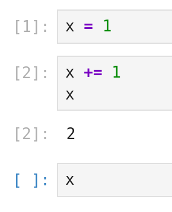
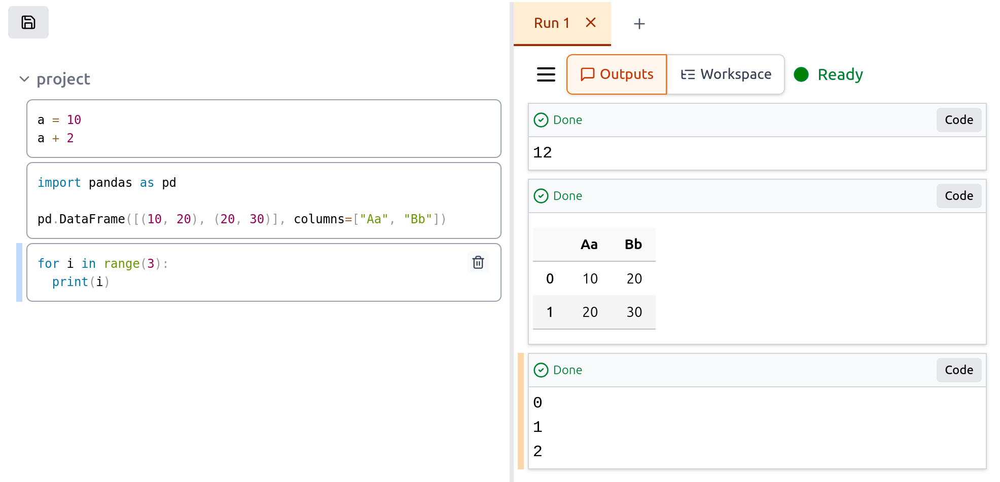
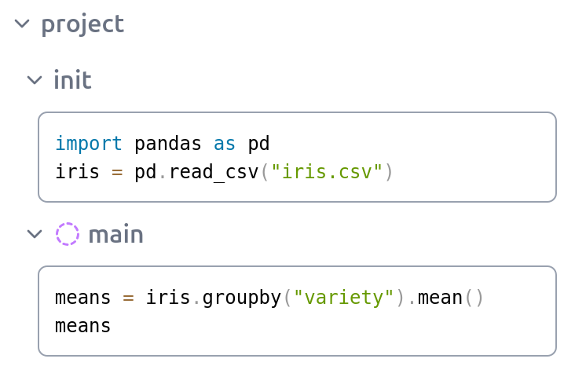
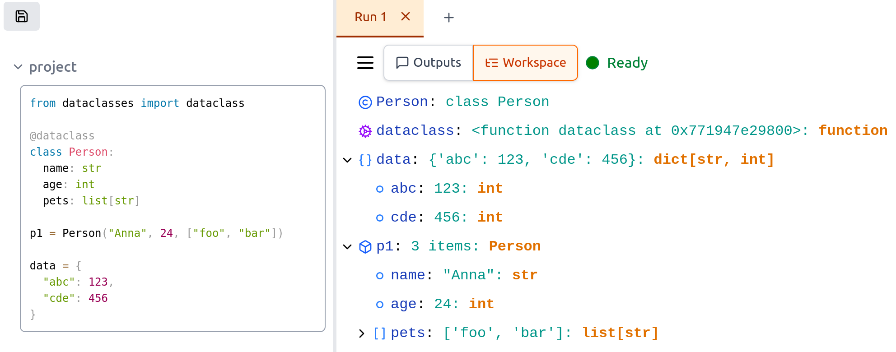

+++
title = "Twinsong: Breaking the Constraints of Linear Notebook Environments"
date = 2025-04-13
+++

Interactive notebooks, like Jupyter, have become indispensable tools for data scientists, researchers, and developers. They offer a fantastic environment for exploration, experimentation, and sharing results. However, as workflows become more complex, many of us start bumping into the limitations inherent in their traditional linear, cell-based structure.

I've spent countless hours in notebooks, and like many others, I've felt the friction points: losing track of execution state, accidentally overwriting variables in the global scope, struggling with outputs breaking the flow of my code, and wrestling with `.ipynb` files in Git. These weren't just minor annoyances; they felt like fundamental constraints hindering productivity and reproducibility, especially on larger projects.

Could we design an interactive environment differently? Could we keep the good parts of notebooks while addressing these core issues? That's the question that sparked **Twinsong**, my experimental, open-source alternative to Jupyter.

**GitHub: [github.com/spirali/twinsong](https://github.com/spirali/twinsong)**

## Example

Let's examine a common issue with traditional notebooks. Take a look at this example:

<p>

</p>

What will be the output when we evaluate the last cell? The answer is: it depends. It could be "2" if all cells were executed in sequence. But it could also be "1" if we had evaluated the first two cells previously, then reset the kernel and evaluated just the first cell before running the last cell.
The cell execution numbering doesn't help either - notice how [1] is from the current kernel run, while [2] is from a previous kernel run that no longer affects our current memory state.


## Breaking Free from Linearity: Decoupling Code and Output

One of the first things I wanted to address was the tight coupling of code and output within the same linear document. In Twinsong, the approach is different:

* **Your code stays clean:** Code resides in a dedicated pane on the left.
* **Outputs flow chronologically:** Results, plots, and print statements appear in a separate pane on the right, ordered by execution time.

This simple decoupling has profound effects:

1.  **Preserved History:** Run a cell multiple times? You get multiple outputs. The previous results aren't lost, making comparison easy. Outputs from different kernel runs are not mixed. Also each output cell remembers the code that was executed to get it.
2.  **Uninterrupted Code Flow:** Long dataframes or complex plots no longer push your subsequent code cells off the screen. Your code remains contiguous and readable.
3.  **Clearer State:** The chronological output log provides a clearer picture of what actually ran and in what order.

<p class="center">

</p>


## Structure for Complexity: Hierarchy and Scoping

Real-world analysis rarely fits into a neat, flat list of cells. We think in terms of phases: initialization, data loading, feature engineering, modeling, evaluation. Twinsong embraces this through **hierarchical code organization**:

* **Tree Structure:** You can nest code blocks arbitrarily, much like folders and files. Organize your work into logical sections like `init`, `data_processing`, `modeling`, etc.
* **Batch Evaluation:** Run an entire subtree (e.g., everything under `init`) with a single command – no more manually stepping through setup cells.
* **Hierarchical Scoping:** By default, nested blocks see variables from their parents. However, you can designate a block to have its **"Private Scope"**. Variables created within that block *stay local* to it, preventing accidental pollution of the global or parent namespaces – a common source of bugs in traditional notebooks[^1].

<p class="center">

</p>

### Example of Scoping

Consider the notebook structure in the screenshot:

* Executing the `init` block defines `pd` (pandas alias) and `iris` (DataFrame) in the parent `project` scope.
* The `main` block, marked with a "bubble" icon, has a **Private Scope**.
* When the code within `main` runs, it successfully accesses `iris` from its parent (`project`) scope.
* However, the newly created `means` variable exists *only* within the private scope of `main` (and any potential children it might have).
* Therefore, `means` is *not* accessible from the `project` scope or other branches. This localization is key to preventing variable name collisions and keeping different analysis steps cleanly separated.

## Managing Runs and Understanding State

Twinsong introduces a couple more features to aid complex workflows:

* **Multiple "Runs":** Need to compare results with slightly different parameters? Or run a long computation while experimenting elsewhere? Twinsong allows multiple independent kernel instances ("Runs") within the same notebook view. Each run has its own isolated memory space and output history.
* **Detailed Workspace:** Go beyond just seeing variable names. The "Workspace" tab provides an interactive, tree-like view of your variables, allowing you to inspect the contents of lists, dictionaries, and dataclasses easily.


<p class="center">

</p>

## Collaboration and Implementation

Collaboration is often painful with notebooks. Twinsong aims to ease this:

* **Git-Friendly Format:** Crucially, code and the outputs from different "Runs" live in separate files. This means cleaner diffs – changes to code don't conflict with changes in output, and you can choose to version only the code or specific runs. Twinsong data are also stored in TOML format, which provides easier merge conflict resolution compared to JSON.

Under the hood, Twinsong uses a Rust-based backend for performance and reliability. The Python kernel implementation is deliberately "clean" – it avoids loading Python modules itself. Since Python can load only a single version of each package, you will get into a trouble in Jupyter when your code wants to use a different version of a package than the one the kernel uses.

## Experimental, But Evolving

Twinsong is still **experimental**. The core ideas are implemented and it should be usable for smaller projects. However, there's much more to do. The UI needs polish (e.g., more keyboard shortcuts), integration with popular visualization libraries like Matplotlib and Plotly isn't ready yet, and features like hot reloading are on the roadmap.

Currently, only Python is supported. While the architecture could support other languages, the focus is on refining the Python experience first, which requires a custom kernel implementation due to Twinsong's properties.

## Give it a Try!

If these ideas resonate with you, I invite you to try Twinsong:

1.  Install it: `pip install twinsong`
2.  Run it: `twinsong` (this starts the local server)

Explore the concepts, see if it fits your workflow, and check out the repository for more details and examples:

**[github.com/spirali/twinsong](https://github.com/spirali/twinsong)**

Twinsong is an experiment in rethinking how we interact with code and data. Feedback and contributions are welcome!


## Footnotes

[^1]: How many global variables does evaluation of the following cell create?

	```python
	total_sum = 0
	for item in [1, 2, 3]:
	    total_sum += item
	```
	
	The answer is two variables: `total_sum` and `item`. In notebooks, you typically don't want variable item polluting your global namespace, but it does anyway. Twinsong's scoping system helps address this issue.
